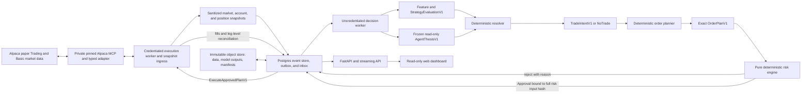

# Alpaca AI Trading Agents Hackathon — High-Level Plan

- Status: working plan, v0.2
- Prepared: 2026-08-28; updated 2026-08-29 with team decisions and verified free-tier constraints
- Submission deadline: 2026-09-04 at 11:00 AM EDT (15:00 UTC)
- Team size: six people, the event maximum
- Default operating mode: Alpaca paper trading only

## Executive recommendation

Build one credible, auditable options agent—not six loosely connected agents and not a miniature hedge-fund platform.

The recommended product is a **regime-aware, defined-risk options-spread agent** researched across SPY, QQQ, TQQQ, SMH, SOXL, and IGV, then deployed only on the one or two symbols that pass common evidence and execution gates. Recent technology/semiconductor/software volatility motivates the candidate set; it is not itself proof of alpha.

- Deterministic quantitative code computes features, selects eligible contracts, sizes positions, enforces risk, constructs orders, and reconciles broker state.
- An AI layer interprets structured market context, forms a thesis and counter-thesis, may veto the frozen champion proposal, and explains the decision; a deterministic resolver makes the executable selection. In V1 the agent cannot change family, width, DTE, selector ranking, or size.
- An independent risk engine has final veto power. The model cannot alter limits, calculate executable size, or reach the execution interface.
- Alpaca's official MCP server is the preferred **private execution-adapter** integration because its current V2 tooling explicitly supports options data and multi-leg option orders. Pin its exact version; the judged model/decision path has no Alpaca MCP transport, package, tool, or credential.
- A read-only dashboard makes every observation, proposal, veto, order, fill, exposure, and P&L change visible to judges.

Working title: **RegimeSwitch — the auditable, risk-gated options agent**. The name can change; the scope should not.

The short pitch is:

> AI for interpretation and orchestration; quantitative code for prices, risk, and execution. Every trade is defined-risk, every refusal has a reason, and every claim can be replayed from frozen artifacts.

Detailed execution documents live under [`docs/index.md`](docs/index.md). This file remains the canonical competition-level scope and decision record; the architecture, strategy plug-in contract, implementation sequence, and research protocol are maintained separately so six people can work in parallel without editing one giant file.

## 1. What the competition actually requires

The live-rendered [official event page](https://lablab.ai/ai-hackathons/alpaca-ai-trading-agents-hackathon) should be treated as the primary source. The team should save a dated PDF or screenshot of the final terms and important Discord clarifications because the page has changed during registration.

### Confirmed event requirements

| Requirement | Current understanding | Team action |
|---|---|---|
| Build window | August 28, 2026 at 11:00 AM EDT through September 4, 2026 at 11:00 AM EDT | Plan to submit by 10:00 AM EDT, not at the deadline |
| Team size | 1–6 people | Six is valid and is the maximum |
| Main track | Options Alpha Agents | Keep the product and demo options-first |
| Product | Autonomous AI trading agent | Show a complete autonomous observe-to-reconcile loop |
| Alpaca technology | Trading API plus either Alpaca MCP server or Alpaca CLI | Use Trading API through the official MCP server; direct REST may support bulk data collection |
| Asset requirement | Every strategy must incorporate options | Every deployable strategy produces option positions; do not rely on an equity-only fallback |
| Capital | Paper trading only | Hard-disable live endpoints and live credentials |
| Judged account | Brand-new paper account dedicated to the event | Do not reuse an existing account or pollute it with integration tests |
| Starting balance | Exactly $100,000 | Verify before the first competition order and never reset without written organizer approval |
| Account evidence | Submit the Alpaca paper account ID | Record it in the private submission checklist, never as a secret |
| Technical write-up | One page covering AI logic, risk gates, and Alpaca infrastructure | Draft by September 2; final copy on September 3 |
| Registration | Each member registers on lablab.ai, joins the same team, and joins the lablab Discord | Complete first thing on August 29 |

### Required submission package

The safest combined checklist from the event page, [lablab submission guide](https://lablab.ai/delivering-your-hackathon-solution), [rule book](https://lablab.ai/hackathon-rules), and [general guide](https://lablab.ai/guide) is:

- Project title.
- Short description, no more than 255 characters.
- Long description, at least 100 words.
- Technology and category tags.
- PNG or JPG cover image; 16:9 is recommended by the generic guide.
- MP4 demo/pitch video, no more than five minutes.
- PDF slide deck.
- Public GitHub repository.
- Deployed, interactive application URL and hosting-platform field.
- Alpaca paper account ID.
- One-page AI/risk/infrastructure write-up.
- Original, open-source, MIT-compliant work and an MIT license in the repository.
- Optional social-award entry: up to five X or LinkedIn posts created during the hackathon. Tag `@AlpacaHQ` and `@lablabai` on X, or the organizations' official LinkedIn pages.

The rule book describes a six-hour manual-submission exception for a pre-approved technical problem. This is emergency relief, not schedule buffer.

The rule book also permits disqualification for plagiarism, voting manipulation, unauthorized automation, cheating, or fraud. Social engagement must be organic; never buy, bot, coordinate fake, or otherwise manipulate reactions.

### Current judging and prizes

The event-specific rubric currently lists:

1. P&L performance in the submitted paper account.
2. Technology implementation, including meaningful Alpaca integration and autonomous-agent behavior.
3. Creativity and originality.
4. Presentation and execution.

The generic lablab rubric also mentions business value. Include one concise target-user and product-extension slide, but prioritize the event-specific rubric.

The live page currently describes $6,300 of total value:

- First: $2,500 cash, with $300 Featherless credits conditional on the applicable partner-integration eligibility rule until organizers clarify it.
- Second: $1,500 cash.
- Third: $1,000 cash.
- Two social winners: $500 cash per team.
- Each member of a social-winning team receives one month of Alpaca Algo Trader Plus.

The page's $6,000 headline is the cash total; the additional $300 is credits. Eligibility, taxation, sanctions, and payout rules remain subject to the event terms.

Before treating the team as prize-eligible, verify every potential recipient is at least 18, is not an Alpaca employee/contractor or an immediate-family/household member, and is not in an excluded or sanctioned jurisdiction. The team must also agree on the individual payee or split process and be prepared to provide the required tax form, government ID, and banking details. These checks are private administrative gates; never commit identity or payout data.

### Team decision and requirements register

The following converts the team's answers into operating policy while keeping unverified organizer details visibly separate. A team preference is not represented as a judging rule.

| Topic | Status and decision | Implementation consequence |
|---|---|---|
| P&L unit | **Team metric:** percentage return from the captured $100,000 baseline. **Official contest rule:** the event page says P&L performance but does not state dollars versus percent. | Store Alpaca account-reported dollars and team-computed percent return; neither is labeled the official contest score until organizers publish the formula. |
| Realized/unrealized | **Organizer detail unresolved.** The team expects realized plus unrealized but will avoid depending on an open-position mark. | Programmatically flatten and cancel on Thursday, then use realized final P&L. Do not hold exposure for Friday judging. |
| Measurement window | **Team default:** baseline at 2026-08-31 09:30 ET; no competition orders before it; no new entries after 2026-09-03 13:30 ET; begin flattening by 15:15 ET and require a broker-confirmed flat account by 15:30 ET. | Store all timestamps in UTC plus display ET. If organizers publish a different window, update the configuration and retain both snapshots. |
| Risk-adjusted metrics | **Team preference:** Sharpe and risk-adjusted evidence matter internally. **Official rubric:** no weights or risk-adjusted formula are published. | Report return, dollar P&L, max drawdown, Sortino, Calmar, and cost stress. Never annualize or promote a Sharpe from four competition sessions. |
| Stale marks and lifecycle events | **Team policy:** fail closed and finish flat. | Long legs mark at executable bid and short liabilities at executable ask; stale/missing quotes block entry and produce `MARK_UNAVAILABLE`, not an invented mid. Avoid expiry-week lifecycle risk, reconcile assignments/expiries, and use remaining maximum loss when no defensible mark exists. |
| Judged account | **Team assumption:** one new dedicated paper account per team. The event requires submission of the fresh paper account ID but does not publish account cardinality or an owner-email rule. | One account owner, one credentialed execution worker, no reset, no development trades, and a baseline snapshot before the first order. Ask organizers only if account cardinality is challenged. |
| Account start | **Team decision:** judged trading begins Monday, 2026-08-31. The event allows any account during development and requires a fresh account for final judging; it does not publish a creation-time restriction. | Develop with fixtures or other paper accounts. Keep the judged account untouched until the Monday baseline and release gate. |
| Options qualification | **Team acceptance rule:** every enabled strategy must open a filled option position. Exercise is not required. An equity position with an actually opened option hedge may qualify, but this is not explicit organizer language. | V1 remains options-first. Treat an unfilled option order as no qualifying options position; do not confuse execution/fill with exercise. |
| Multi-leg, short legs, 0DTE | **Team operating assumption:** permitted. Alpaca supports Level 3 multi-leg paper orders and covered short legs in defined-risk structures; the event page does not separately enumerate 0DTE or Level 3. | Support multi-leg defined-risk plans in the platform. Keep 0DTE disabled in the initial risk profile; it may be enabled only through a separately approved profile after quote, expiry, and exit tests. |
| Market-data entitlement | **Verified Alpaca platform fact:** Basic provides IEX equities and an indicative options feed, 200 historical calls/minute, 30 equity stream symbols, 200 option quote subscriptions, and the documented recent-15-minute historical restriction. Indicative quotes are modified derivatives of OPRA, not actual OPRA quotes; indicative trades are delayed 15 minutes. | Set `feed=iex`/`feed=indicative` only where the endpoint accepts it. Historical option bars/trades expose no feed query parameter, so record `requested_feed=N/A_ENDPOINT_HAS_NO_FEED_PARAM` plus entitlement evidence; never invent a parameter or claim actual OPRA BBO. Cache immutable responses and throttle centrally. |
| Required Alpaca tools | **Verified event rule:** Trading API plus either Alpaca MCP server or Alpaca CLI. | Use Trading API plus MCP for the judged path. The CLI is optional, not a second requirement. |
| Judging priorities | **Verified categories:** P&L, technology implementation, creativity/originality, and presentation/execution; no numeric weights are published. **Team priority:** P&L and implementation first. | Allocate build time to a reliable trading loop, evidence, and auditability before visual novelty. |
| Community voting | **Organizer confirmation required.** The live page has a community-heart ranking; separately, builder/referral points are stated not to affect submission evaluation; external social engagement has separate prizes. None establishes whether community hearts influence finalists or winners. | Treat the four published judging categories as the build rubric, keep hearts/points/social prizes distinct, and never manipulate engagement. |
| Hosting | The event requires a public repository, demo platform, and interactive application URL. The generic guide says to opt for Streamlit, Replit, or Vercel but does not say those are exclusive. | Preferred topology is a Vercel frontend plus a publicly reachable container backend, managed Postgres, and object storage. Confirm the chosen backend host in Discord; keep a credential-free replay mode for judges. |
| Featherless | Not a core technical requirement. Relevant partner technology must be integrated for the applicable partner-credit/prize component; whether omitting it affects the bundled first-place package or main cash placement is not explicit. | Keep a provider-neutral `ModelPort`. Run Featherless only if it improves the product without delaying the core; never make it an execution dependency. |
| IBM Bob report | **Team decision:** treat this as a generic-guide anomaly/cross-event text. It is absent from the event-specific brief; the cause and applicability are not organizer-confirmed. | Do not build or submit it unless organizers explicitly require it in writing. |

### Remaining organizer confirmations

Only these materially unresolved facts should be posted in Discord:

1. Is official P&L dollar or percentage return, and is it realized-only or realized plus unrealized?
2. What exact account/trade timestamps define the judged P&L window, and are manual closes or account resets prohibited?
3. What mark and stale-price policy is used for open options at judging, if any?
4. Does “incorporate options” require an option fill/open position, and is equity plus a separately executed option hedge eligible?
5. Are 0DTE and all Level 3 defined-risk structures explicitly accepted for this event?
6. Are there numeric judging weights, and is the Vercel-frontend/container-backend topology accepted?

Until written clarification arrives, follow the stricter implementation: one fresh $100,000 team paper account, options in every enabled strategy, Trading API plus official MCP, no reset or discretionary manual entries, and an execution-worker-controlled Thursday flatten. A manual close is reserved for an emergency kill procedure, must be logged with operator/time/reason, and is never the normal strategy path.

## 2. Senior quant assessment

### This is a tournament, not a statistically meaningful investment record

At the time this plan was written, the Friday kickoff session had ended. The calendar offers four full sessions, Monday through Thursday, plus only the first 90 minutes of Friday before the 11:00 AM submission deadline. The team will use Monday–Thursday only and flatten Thursday; Friday remains submission buffer. A P&L result over four sessions is dominated by path dependence and variance and cannot prove durable alpha.

If judges heavily weight raw P&L, that incentive may reward excessive risk. A conservative strategy may have a good expected Sharpe yet a lower chance of a high P&L outcome than competitors buying lottery-like options. Because the event publishes no weights or pure-P&L leaderboard rule, the team must explicitly choose its objective without pretending the rubric is known:

- **Balanced objective, recommended:** maximize the probability of a strong judged submission with positive expected P&L, bounded downside, excellent technology, and a polished demo.
- **Tournament objective:** accept greater variance to maximize the chance of a high P&L criterion outcome.
- **Product objective:** optimize for a defensible post-hackathon system, treating competition P&L as a demonstration only.

Do not drift between these objectives trade by trade. Record the selected objective and maximum acceptable paper drawdown before the first competition order.

### A narrow agent will beat a theatrical multi-agent system

The likely failure mode is an impressive diagram with five LLM personas, weak data semantics, no realistic option cost model, and an unreliable order path. One primary signal, one deterministic risk kernel, and one polished end-to-end trace are much stronger.

Use a proposer/critic pattern only if it adds visible value:

- The proposer produces a structured thesis from approved evidence.
- The critic identifies contradictory evidence and reasons to abstain.
- Deterministic policy resolves the output into an approved strategy template or `NO_TRADE`.

Do not let “agent debate” become the strategy.

### The LLM should not be the price model

LLMs are useful here for event classification, regime narration, evidence synthesis, tool orchestration, and explanations. They are not trustworthy calculators of Greeks, maximum loss, buying power, or order price. They also cannot create validation data that does not exist.

The model may:

- Label a structured market regime.
- Extract a catalyst into a fixed schema.
- Produce a thesis, counter-thesis, confidence, and expiry time.
- Recommend `NO_TRADE` or critique the strategy template already selected by the frozen quantitative policy; V1 does not let the model substitute another family, DTE, width, ranking, or size.
- Explain why a deterministic gate accepted or rejected an intent.

The model may not:

- Invent or transcribe executable prices.
- Choose arbitrary option legs.
- Calculate position size or maximum loss.
- Modify risk configuration.
- Promote a strategy.
- Call the execution gateway or arbitrary shell commands.
- Treat news, webpages, or other external text as instructions.

### Paper P&L needs an honesty layer

[Alpaca's paper environment](https://docs.alpaca.markets/us/v1.4.2/docs/paper-trading) does not fully model market impact, information leakage, latency slippage, queue position, or displayed size. It can therefore produce fills that would be implausible in live options trading. The free data tier also provides limited equities coverage and an indicative rather than full OPRA options feed; see [Alpaca's market-data plans](https://docs.alpaca.markets/us/docs/about-market-data-api).

We should display two performance views:

- **Alpaca account-reported paper P&L:** exactly what the paper account reports; this is evidence, not an organizer-defined official contest score.
- **Conservative shadow P&L:** our own mark and cost assumptions using bid/ask width, latency, missed fills, and a doubled-cost stress.

Never blend backtest, shadow, and competition results into one number.

## 3. Product definition

### Target user

A sophisticated self-directed trader or small investment team that wants an autonomous options workflow but will not accept an opaque model with direct broker authority.

### Core user journey

1. Observe a timestamped market and account snapshot.
2. Classify the session as trending, range-bound, or unsafe.
3. Produce a structured thesis and counter-thesis.
4. Deterministically resolve the advisory output into a validated options strategy template or abstain.
5. Select liquid, valid contracts and compute an exact proposed spread.
6. Apply deterministic portfolio, Greek, liquidity, and operational risk gates.
7. Submit one atomic multi-leg limit order through Alpaca paper trading.
8. Monitor order state, reconcile positions, and apply deterministic exits.
9. Show the entire lineage and deterministically replay downstream logic from frozen market and model-output artifacts.

### Must-have scope

- Research allowlist: SPY, QQQ, TQQQ, SMH, SOXL, and IGV plus their listed options, using only Alpaca Basic/free-tier API or read-only MCP market data.
- Trading allowlist at launch: the one or two symbols that pass the common feasibility, research, quote-quality, and operational gates; SPY/QQQ are liquidity controls, not automatic winners.
- Defined-risk options only: long options or vertical debit spreads in V1.
- One primary strategy and, only if it independently passes, one fallback.
- Official Alpaca MCP integration pinned to a tested version.
- Paper-only execution with a competition-account allowlist.
- Deterministic risk engine and order state machine.
- Immutable decision/audit trail.
- Read-only public dashboard plus recorded replay mode.
- Hosted demo, public code, one-page write-up, slides, and video.

### Explicit non-goals before submission

- No live trading path.
- No naked option selling.
- No 0DTE in V1.
- No HFT or low-latency claims.
- No new foundation-model training or reinforcement-learning project.
- No Kubernetes, Kafka, service mesh, or six microservices.
- No multi-broker abstraction.
- No arbitrary tool or shell access for the model.
- No more than one primary and one fallback strategy.
- No production feature whose only implementation is in a notebook.

The reusable architecture and strategy SDK must accept any registered strategy plug-in, but hackathon scope stays narrow through the registry and deployment allowlists. See the [system architecture](docs/architecture/SYSTEM_ARCHITECTURE.md), [strategy API](docs/architecture/STRATEGY_API.md), [skeleton implementation plan](docs/plans/SKELETON_IMPLEMENTATION_PLAN.md), and [strategy research plan](docs/plans/STRATEGY_RESEARCH_PLAN.md).

## 4. Software architecture

### Architectural choice

Use a **modular monolith with ports and adapters**, deployed as four process roles from one codebase:

- `web`: strictly read-only dashboard for decisions, risk, audit, and P&L.
- `api`: strictly read-only projections, replay, and streaming updates, using a database role limited to `SELECT` on read-model views.
- `decision-worker`: uncredentialed scheduler and consumer of sanitized snapshots; runs features, strategy/agent workflow, order planning, and final risk evaluation.
- `execution-worker`: the sole competition-credentialed process; ingests broker-authoritative market/account/position snapshots, consumes immutable risk-approved plans, submits orders, and reconciles broker state.

Arming and halting use a private authenticated one-shot operator CLI/job, never the public API or judge UI. Negative authorization tests must prove the public role cannot mutate control/event/outbox state or reach execution networking.

This is fast enough for the hackathon and has clean extraction boundaries if the project continues. The decision and execution workers communicate only through a Postgres transactional outbox/inbox; the model process never receives broker credentials. Postgres is the runtime source of truth. Immutable Parquet/JSON inputs, model outputs, and run manifests go to content-addressed S3-compatible storage (or a verified managed persistent volume) from Day 1 so an ephemeral deployment cannot erase the evidence. Redis is optional and should be added only if a worker actually needs a distributed queue or short-lived cache.



Alpaca's market-data authentication is not assumed to be read-scoped. The judged account key therefore stays in the execution trust zone even for reads; the decision worker receives only schema-limited sanitized snapshots. Offline research collection may use a separate development paper account and approved market-data endpoints, never the competition credential.

### Non-negotiable component boundaries

| Boundary | Responsibility | Forbidden behavior |
|---|---|---|
| `MarketDataPort` | Normalize clock, bars, quotes, chains, contracts, and news; attach feed, `event_time`, `available_time`, freshness, and quality | Strategies parsing raw Alpaca payloads |
| `StrategyPort` | Generate a signal and request a strategy template/risk budget | Broker credentials, final sizing, or order submission |
| `StrategyRunnerPort` | Execute only registry-pinned repository plug-ins through schema-limited canonical JSON with cleared environment, no network, minimal read-only filesystem, and resource limits | Importing plug-ins into the decision-worker process or treating import lint as a runtime boundary |
| `AgentPort` | Produce a schema-valid advisory thesis, counter-thesis, regime/event labels, evidence references, and veto recommendation; persist the output | Execution tools, arbitrary contracts, numeric risk calculations, template substitution, or direct executable selection |
| `OrderPlannerPort` | Deterministically resolve an allowed template into exact legs, quantity, limit, TIF, and client order ID | Network I/O, broker credentials, or altering fixed risk limits |
| `RiskPort` | Pure evaluation of `RiskInputV1`, including exact plan, market/account/position/order-risk snapshots and every frozen authorization hash; bind approval to `risk_input_hash` and expiry, then reserve capacity atomically | Network I/O, model calls, mutable hidden state, plan-hash-only approval, or silently modifying the plan |
| `ExecutionPort` | Collect and publish sanitized broker-authoritative snapshots; submit, cancel, and reconcile an already approved order plan | Exposing credentials/raw mutation tools downstream, or accepting any command whose full `risk_input_hash`, latest order-risk/account/position versions, quote TTL, or approval differs |
| `LedgerPort` | Append immutable decision and broker events and expose read models | Rewriting prior decisions or silently correcting history |

### Required data contracts

Use Pydantic models as the source of truth, export JSON Schema, and generate frontend types from the FastAPI OpenAPI document. After the first integration freeze, changes must be backward-compatible.

Every event uses `EventEnvelopeV1` with:

- `schema_version`
- `event_id`
- `event_type`
- `aggregate_id`
- `aggregate_version`
- `occurred_at`
- `received_at`
- `producer`
- `run_id`
- `correlation_id`
- `causation_id`
- `payload`

Core payloads:

- `MarketSnapshotV1`: quotes, bars, eligible chain subset, Greeks/IV when available, feed, timestamps, freshness, quality flags, and content hash.
- `FeatureVectorV1`: exact lagged inputs and calculation version.
- `StrategyEvaluationV1`: registry-pinned plug-in ID/version/content hash, context/config hashes, explicit next state, reason/evidence references, and a semantic `NO_TRADE`, template request, or logical position directive. It cannot contain exact contracts or broker fields.
- `AgentThesisV1`: advisory thesis, counter-thesis, `ALLOW_UNCHANGED | VETO` recommendation, diagnostic confidence, expiry, source references, model/prompt versions, immutable raw-output hash, and bindings to context, strategy-evaluation, and model-input hashes. This frozen artifact—not a fresh model call—is an input to deterministic replay; confidence and rationale cannot alter executable fields.
- `TradeIntentV1`: deterministic template choice, direction/horizon, requested risk budget, exit policy, intent expiry, and all provenance; it is not yet executable.
- `OrderPlanV1`: exact legs, integer quantities, limit debit/credit, TIF, deterministic client order ID, market/account/position/order-risk versions, and content hash.
- `OrderRiskSnapshotV1`: versioned working/pending/unknown broker orders plus unexpired approved-but-nonterminal worst-case-loss reservations and remaining quantities.
- `RiskInputV1`: canonical exact plan plus market/account/position/order-risk hashes, risk policy, template catalog, strategy registry/config/content, mode, account allowlist, and release hash.
- `RiskDecisionV1`: approval/rejection bound to the exact `risk_input_hash`, approval expiry, stable reason codes, maximum loss, exposure, and breached limits.
- `ExecuteApprovedPlanV1`: immutable exact plan plus its approval, identical `risk_input_hash`, snapshot provenance, and one command hash.
- `ExecutionPreflightDecisionV1`: execution-side allow/reject result bound to the command hash, quote TTL, and latest reconciled account/position/order-risk versions immediately before submission.
- `ArmCommandV1` / `HaltCommandV1`: single-use operator commands bound to nonce, expiry, expected mode/version, account allowlist, release/config/policy hashes, fresh reconciliation hash/version/time, operator identity, and CAS transition.
- `BrokerEventV1`: accepted, rejected, partial fill, fill, cancel, expiry, broker IDs, and timestamps.
- `PositionSnapshotV1` and `PnLSnapshotV1`.
- `DecisionTraceV1`: artifact IDs, tool calls, model/prompt version, structured rationale, latency, and cost. Store concise rationale, never private chain-of-thought.
- `RunManifestV1`: Git commit, config hash, data hashes, model version, prompt hash, start/end timestamps, and result status.

Use decimal strings for money, integer option quantities, and UTC RFC 3339 timestamps. Do not use binary floats for executable prices.

### Order state machine

```text
PROPOSED → PLANNED
             ├── RISK_REJECTED
             └── APPROVED → SUBMITTED
                              ├── REJECTED → RECONCILED
                              ├── CANCEL_PENDING → CANCELLED → RECONCILED
                              ├── PARTIALLY_FILLED → CANCEL_PENDING / FILLED / EXPIRED
                              ├── FILLED → RECONCILED
                              └── UNKNOWN → RECONCILIATION_REQUIRED → RECONCILED
```

Every retry reuses a deterministic `client_order_id`, but an uncertain submission is reconciled by that ID before any retry. Any leg, quantity, limit-price, repricing, snapshot, policy, template, registry, mode, account allowlist, or release change creates a new `risk_input_hash` and requires a fresh, unexpired risk approval. The execution gateway recomputes that full hash, recomputes quote TTL at submission, and requires account/position versions to equal the latest reconciled state. Any mismatch requires replanning and reapproval.

The event store and execution inbox require unique constraints on `(account_id, client_order_id)` and `(intent_id, plan_hash)`, inbox deduplication, and monotonic aggregate sequence numbers. The execution worker holds an account-level lease/advisory lock so two replicas cannot submit concurrently. Record fills per leg and re-run position/risk reconciliation after every partial or terminal transition.

### Proposed repository layout

```text
/
├── apps/
│   ├── api/
│   ├── decision_worker/    # no broker credentials
│   ├── execution_worker/   # sole competition-credentialed role
│   ├── operator_cli/       # private one-shot arm/halt client
│   └── web/
├── packages/
│   ├── contracts/          # Pydantic schemas and generated JSON Schema
│   ├── domain/             # canonical hashing and pure state machines
│   ├── strategy_sdk/       # public plug-in protocol only
│   ├── strategy_runner/    # isolated canonical-JSON plug-in process
│   ├── decision_core/      # deterministic resolver
│   ├── agent/              # frozen advisory output adapter
│   ├── order_planner/      # exact contracts, quantities, and limits
│   ├── risk_kernel/        # pure final risk and hard preflight
│   ├── market_data/        # normalized snapshot contracts/adapters
│   ├── ledger/             # event store, outbox/inbox, read models
│   ├── execution_core/     # execution aggregate/state machine
│   ├── alpaca_execution_mcp/ # private pinned adapter
│   └── object_store/
├── strategy_plugins/
│   ├── always_no_trade_v1/
│   └── regime_momentum_v1/
├── schemas/v1/
├── research/               # common manifests, runs, reports, notebooks
├── configs/
│   ├── risk/
│   ├── strategy_registry.yaml
│   └── template_catalog.yaml
├── tests/
│   ├── architecture/
│   ├── contract/
│   ├── property/
│   ├── replay/
│   ├── security/
│   ├── integration/
│   └── e2e/
├── infra/
├── docs/
├── .github/workflows/
├── AGENTS.md
├── CONTRIBUTING.md
├── SECURITY.md
├── LICENSE
├── README.md
├── HACKATHON_PLAN.md
├── pyproject.toml
├── uv.lock
└── compose.yaml
```

The normative dependency DAG and full target layout are in [`docs/architecture/SYSTEM_ARCHITECTURE.md`](docs/architecture/SYSTEM_ARCHITECTURE.md). Directories are created as their vertical-slice code lands, not as empty scaffolding for its own sake.

### Recommended stack

- Python 3.12 for research, domain, workers, and API.
- Native ARM64 `/opt/homebrew/bin/uv` with an explicitly verified `macos-aarch64` Python.
- FastAPI, Pydantic, SQLAlchemy/Alembic, asyncpg, and HTTPX.
- Polars, DuckDB, PyArrow, NumPy, and SciPy for research.
- PostgreSQL for the event/audit store.
- S3-compatible object storage or a verified managed persistent volume for immutable data, model outputs, and run manifests.
- React/Next.js or React/Vite with TypeScript for the dashboard; choose the frontend stack the owner can ship fastest.
- Server-sent events for the decision tape; the public app has no bidirectional control channel.
- Docker Compose for local supporting services with ARM64-compatible images.
- Vercel for the public web app plus a container PaaS, managed Postgres, and persistent object storage for backend roles; confirm the backend host with organizers. Avoid Kubernetes.
- Provider-neutral `ModelPort`; the first implementation can use whichever LLM provider the team already has funded and working.

Before selecting or creating a local runtime:

1. Verify `uname -m` is `arm64`.
2. Verify the selected `uv` binary is native ARM64.
3. Select an explicit `macos-aarch64` uv-managed Python and a separate ARM-only install directory.
4. Require `platform.machine() == "arm64"` in the bootstrap check.
5. Never use `/usr/local/Homebrew`, `/Users/lipengyuan/anaconda3`, Rosetta, or an x86 uv interpreter cache.
6. Stop and ask before using any dependency without native Apple Silicon support.

### Scalability path after the hackathon

Keep the modular monolith now. If workload demands it later:

- Extract market-data ingestion behind `MarketDataPort`.
- Extract the durable agent workflow behind the event/outbox contract.
- Move the already isolated execution role into its own service/repository only if operational scale requires it.
- Partition event data by account/run/date.
- Add a real job queue only when one worker is insufficient.

No component should know another component's database tables; communicate through domain interfaces and versioned events even while they share one process and database.

## 5. Strategy research program

### Common research contract

Each researcher must preregister a hypothesis before reading the final holdout result:

```yaml
id:
owner:
economic_intuition:
universe:
required_data:
signal_timing:
entry_rule:
exit_rule:
contract_selection:
risk_limits:
tunable_parameters:
falsification_tests:
known_failure_modes:
status: proposed
```

Each experiment produces a manifest containing:

- Run ID and timestamp.
- Git commit.
- Frozen configuration hash.
- Dataset manifest/hash and exact coverage.
- Model/prompt version and seed, if applicable.
- Fold boundaries.
- Costs, latency, and fill assumptions.
- Metrics and full trade ledger.
- Pass/fail outcome and reason.

Notebooks may explore; only tested package code may enter either competition worker.

### Parallel candidate workstreams

Round 0 remains a standardized six-symbol **data feasibility** scan owned by the data steward. Alpha research is now delegated by economic hypothesis rather than ticker: every owner evaluates one frozen strategy family over every compatible feasible symbol through one shared backtester.

| Research owner | Strategy family | Common expression |
|---|---|---|
| Person 1 | Same-time normalized 60-minute continuation plus VWAP confirmation | Debit vertical |
| Person 2 | Normalized VWAP reversion in a weak-trend regime | Debit vertical |
| Person 3 | First-30-minute opening-range breakout with volume/VWAP confirmation | Debit vertical |
| Person 4 | Standardized overnight-gap continuation after first-hour confirmation | Debit vertical |
| Person 5 | Benchmark-residual relative strength across the ETF clusters | Debit vertical |
| Person 6 | Intraday range-compression breakout with volume/VWAP confirmation | Debit vertical |

These research assignments are secondary hats and do not replace the primary engineering ownership in Section 7. Owners share immutable Alpaca data, features, costs, folds, selector/sizer, portfolio constraints, artifacts, and conformance tests. They may not create six private engines or optimize a separate threshold per ticker.

After the feasibility scan, select at most three symbols for expensive option-history work and at most two for the competition allowlist using blinded data/coverage/liquidity fields, not P&L. All viewed strategy × symbol variants remain in the selection-adjustment family. The detailed formulas, interface-readiness blockers, artifact schemas, tests, and promotion gates in [`docs/plans/STRATEGY_RESEARCH_PLAN.md`](docs/plans/STRATEGY_RESEARCH_PLAN.md) are normative.

Contract selection remains owned by options/risk; advisory context remains veto-only; a non-author must reproduce the champion. No researcher can self-promote a plug-in or bypass a failed platform/risk gate.

Do not blend candidate signals during discovery. Select one champion and at most one clearly independent fallback by a fixed cutoff.

### Primary hypothesis

Research universe: SPY, QQQ, TQQQ, SMH, SOXL, and IGV. The deployable universe is the gated subset; do not add a seventh symbol during the hackathon.

The six normative central candidates are H1 continuation, H2 VWAP reversion, H3 opening-range breakout, H4 gap continuation, H5 benchmark-residual relative strength, and H6 compression breakout. H1 remains the golden harness fixture and must reproduce on two native ARM64 machines before comparative outcomes are opened. Each family is preregistered and evaluated independently; no blend, ensemble, threshold change, breadth/news addition, or per-symbol optimization is allowed after results without a new candidate version. Exact formulas, latency, cadence, sensitivities, and falsification rules live in the normative research plan.

Initial contract policy:

- Load the exact committed `configs/template_catalog.yaml` in both research and runtime and record its canonical hash.
- Primary 7–14 DTE with the minimum positive calendar DTE selected; 15–21 DTE is a stability bucket, not a second optimization search.
- Long leg is the standard strike nearest raw spot with OTM tie-break. Call short target is `long_strike × 1.01` and chooses the smallest listed strike at/above it; put short target is `long_strike × 0.99` and chooses the largest listed strike at/below it. Missing targets/observations produce infeasible/`NO_PROXY_FILL`, never coverage-aware reranking.
- Current Greeks are diagnostic/veto inputs only and cannot change the frozen ranking rule.
- Atomic multi-leg limit order only.
- Debit strictly below spread width.
- No naked legs, no legging, and no 0DTE.

These are research starting points, not promises of profitability.

O2 debit vertical is the sole promotion-eligible competition expression. O1 single-long results are a fixed diagnostic of whether the second leg's cost destroys the signal, not an alternate winner. The primary DTE bucket is 7–14 days and 15–21 days is stability-only. The frozen 60-minute signal does not automatically justify paying two option-leg spreads, so failure of O2 produces `NO_TRADE`/demo-only rather than a post-holdout switch to O1.

### Exit and competition-close policy

The strategy manifest must freeze these before final validation:

- Earliest entry time and latest entry cutoff.
- Maximum holding time.
- Strategy-level premium profit-taking and price-based stop exits are disabled in V1; only the frozen VWAP/time exits apply. Portfolio daily/competition stops and stale/reconciliation/orphan remediation remain non-tunable safety overrides.
- Signal-invalidation and regime-change exits.
- Whether overnight exposure is allowed; default is intraday only.
- Cancel/replace limits and a multi-leg reduce-only exit procedure.
- Expiration, ex-dividend, assignment, and orphan-leg handling.
- Final competition liquidation time.

Default to no new entries late enough that the frozen 60-minute horizon and orderly exit cannot complete before the close. For the final session, stop new entries at 13:30 ET on Thursday, September 3, begin the execution-worker cancel/flatten state machine no later than 15:15 ET, and require a broker-confirmed flat account by 15:30 ET. Capture a final order/fill/position/equity snapshot after reconciliation. This converts the final result to realized P&L and avoids stale option marks, expiration, exercise, and assignment ambiguity. Do not make Friday morning liquidation a dependency.

Alpaca exposes position-closing APIs, so positions can technically be closed before submission. The normal path must be deterministic execution-worker controlled and audited. A dashboard/manual close is emergency-only until organizers confirm that manual activity is permitted; if used, record operator, timestamp, reason, before/after snapshots, broker order IDs, and reconciliation result.

### Contract eligibility gates

A proposed spread is eligible only if all checks pass:

- Approved underlying, expiration, option type, and strategy template.
- Current, non-crossed, two-sided quotes for all legs.
- Quote age below the configured threshold.
- Bid/ask width below both absolute and percentage limits.
- Sufficient observed activity where the feed provides reliable volume/liquidity fields.
- Valid contract state and whole-number quantities.
- Known maximum gain and defined maximum loss.
- No expiration/assignment conflict with the planned holding period.
- Options market is open.
- All legs can be submitted atomically.
- Limit price stays inside the risk-approved maximum debit.

Start near a conservative executable price and allow only a small bounded repricing schedule. Never chase beyond the approved debit.

### Time-safe data and backtesting

Every observation needs:

- `event_time`: when the market event occurred.
- `available_time`: when the system could have known it.
- Ingestion timestamp.
- Source and feed.
- Strategy/feature version.
- Exact feed identity and entitlement, including indicative versus OPRA.

A signal created at a bar close may trade only on the next eligible quote or bar. Never fill on the same close used to compute the signal.

Required data:

- Underlying minute bars for the six-symbol research allowlist.
- Point-in-time contract-existence proxy records and expirations; these do not reconstruct a historical displayed chain or prove tradability.
- Historical option bars/trades where entitlement and coverage permit; the free historical surface does not provide an executable historical option-quote series.
- Prospectively captured option-chain snapshots with timestamps and Greeks.
- Alpaca clock/calendar.
- Timestamped Alpaca news only if the modifier is enabled and the same free-tier/API-only lineage and availability-time requirements are satisfied.
- Immutable Parquet snapshots plus source/query/coverage/row-count/hash manifests.

Research retrieval is restricted to the Alpaca Basic/free-tier Market Data API or individually allowlisted read-only Alpaca MCP tools. Do not supplement gaps with Yahoo, Polygon, Cboe, OPRA, vendor downloads, or hand-copied prices. Missing free-tier evidence narrows the claim or forces `NO_TRADE`; it does not authorize a substitute dataset.

[Alpaca documents historical option data](https://docs.alpaca.markets/us/docs/historical-option-data) only from February 2024. The common detailed protocol uses:

- Underlying discovery: 2017–2023.
- Option feasibility/proxy calibration: February–December 2024.
- Quarterly walk-forward OOS: January–December 2025.
- Intended final validation: January 1–August 27, 2026, only called sealed if its hash/access gate existed before inspection.

Hash and access-control the intended holdout before research begins. If anyone has already inspected it, call it `final_validation`, disclose the prior exposure, and do not claim it was sealed. Use rolling or expanding time-series folds, never random train/test splits.

The cost model must include:

- A conservative one-minute option-bar proxy for every historical leg, with both vertical legs in the same interval and a maximum five-minute fill window.
- A frozen $0.05 tick proxy where historical tick metadata is unavailable.
- A frozen $0.10 per-contract/per-leg/per-side base cost placeholder, $0.00/$0.25 sensitivities, and a 2× central-cost stress.
- Missed, incomplete, and punitive missing-exit proxy outcomes.
- Quote staleness.
- Base-cost and 2×-cost stress.
- Runtime-consistent marks: value liquidation conservatively at the long-leg bid and short-leg ask rather than an indicative mid.

Historical option results are `bar_proxy_*` evidence only, never fill, bid/ask, or execution-quality evidence. Prospectively captured indicative quotes supply the runtime bid/ask gates and conservative marks. Mid-price backtests are diagnostic only and must not be described as executable results.

When indicative quotes or Greeks are not trustworthy, size from premium/worst-case loss and moneyness or abstain. Do not combine OPRA-based research assumptions with an indicative-feed runtime without an explicit translation and stress test.

If option history is inadequate, keep three layers visibly separate:

1. Underlying-signal backtest.
2. Conservative option-payoff simulation.
3. Actual forward paper evidence.

### Anti-overfit rules

- Cap each hypothesis at roughly 20–30 parameter configurations.
- Log every run, including failed and abandoned runs.
- Freeze parameters before opening the final holdout.
- Require reasonable stability in neighboring parameter values.
- Reject a strategy dominated by one trade, day, symbol, or volatility regime.
- Compare with cash, SPY buy-and-hold, a simple momentum baseline, and matched-exposure random directions.
- Stress one-bar delay, doubled spreads, missing data, stale quotes, and regime slices.
- Run a no-LLM ablation.
- Purge and embargo folds by at least the maximum holding horizon.
- Bootstrap by session and cluster inference by date; overlapping SPY/QQQ intraday trades are not independent observations.
- Require evidence across multiple independent sessions/regimes and account for hypothesis/parameter selection.
- Never annualize or market a Sharpe ratio from the competition week.

### Strategy promotion gates

Lifecycle:

```text
proposed → research_only → backtested → paper_candidate → paper_enabled → retired
                                      └───────────────→ paper_demo_only
```

Promotion to `paper_enabled` requires:

- Documented economic intuition and falsification condition.
- Point-in-time inputs with no known look-ahead.
- Positive net out-of-sample result under base costs.
- Non-negative total OOS normalized-account return under doubled costs.
- One-sided family-wise adjusted maximum-statistic `p <= 0.10` on complete 2025 OOS daily account returns for the frozen selectable candidate family; 2024 calibration and post-selection 2026 results are not pooled into this authorizing test. Otherwise the candidate remains shadow/demo-only and carries no alpha claim.
- Drawdown inside the predeclared budget.
- No positive trade above 25% of `sum(max(net_trade_pnl, 0))` and no positive date above 25% of `sum(max(daily_pnl, 0))` over the evaluated OOS period.
- Adequate trade coverage; the detailed gate targets at least 75 OOS trades across 40 active sessions and four populated quarterly folds, but reports independent session/regime blocks separately and never treats correlated trades as independent confirmations.
- No sharp parameter cliff.
- Passing missing/delayed-data, replay, risk, reconciliation, and kill-switch tests.
- Independent reproduction from frozen inputs.
- Explicit human approval in the strategy registry.

No LLM and no automated metric can promote a strategy. If no candidate passes, it must not become `paper_enabled`. The honest outcomes are `NO_TRADE`, or—only if an executed workflow is needed for judging—a separately authorized `paper_demo_only` one-contract scenario that passes every safety/operational gate and makes no alpha claim.

## 6. Initial risk policy

These are proposed starting limits for discussion, not official contest rules and not model-editable:

- Default fee-inclusive maximum defined loss per trade: the smaller of $500 and 0.50% of current equity; raising it toward 0.75% requires a separately approved tournament-risk profile and is outside the frozen research candidate.
- Aggregate open maximum loss: no more than the smaller of 2% of equity and the unused daily hard-loss capacity.
- Daily soft stop: 1%.
- Daily hard stop and halt: 2%.
- Competition hard stop: 4%.
- Maximum three concurrent spreads.
- Maximum one directional position per underlying.
- Correlated clusters are explicit: QQQ/TQQQ/IGV form a technology-beta cluster; SMH/SOXL form a semiconductor cluster; SPY overlaps both as the broad-market factor. Normally prohibit simultaneous same-direction positions within a cluster unless combined beta-adjusted dollar delta and remaining worst-case loss fit both cluster and portfolio caps.
- Maximum order attempts and completed entries per session.
- Portfolio delta, gamma, and vega limits.
- Cooldown after exits, rejects, or repeated identical signals.
- No naked short options.
- No 0DTE.
- No options orders outside regular options hours.
- Exit before expiration/assignment risk becomes material.
- Preserve each spread's leg-ratio invariant; detect ex-dividend/assignment risk, partial exits, and orphaned legs.
- No order on stale, missing, crossed, or abnormally wide quotes.
- Pause after repeated API failures, order rejects, or any reconciliation mismatch.
- Pre-submit buying-power, max-loss, exposure, and duplicate-intent checks.
- Idempotency key on every order intent and order plan.
- Reconcile broker orders, fills, positions, and cash after every execution event.
- Manual kill switch plus automatic stale-data, loss, and reconciliation halts.

Before approving a new plan, require:

```text
realized session loss
+ conservative unrealized liquidation loss
+ remaining loss-to-maximum on open positions
+ worst-case remaining loss on working/pending/unknown orders
+ unexpired approved-but-unsubmitted risk reservations
+ proposed plan maximum loss
<= daily hard-loss limit
```

Build a prospective order-risk snapshot containing the proposed reservation, evaluate risk against it, then CAS the prior version and commit the prospective snapshot, approval, reservation, and outbox insertion atomically under the account lock. V1 allows only one nonterminal exposure-increasing reservation/order at a time. Accepted-unfilled, partial, and unknown orders keep conservative remaining-quantity reservations until broker reconciliation converts or releases them, so concurrent plans cannot spend the same capacity.

If a partial exit, assignment, exercise, or failed close creates an orphaned short leg, halt new entries, cancel related working orders, reconcile every leg, alert the operator, and execute only the preapproved orphan-remediation procedure. Never improvise a model-authored hedge.

Hard paper-only controls:

- Allowlist the Alpaca paper API hostname and expected competition account ID.
- Fail startup if any live-trading environment flag or live hostname is detected.
- Do not deploy live credentials.
- Only the execution worker holds competition credentials.
- The only judged-runtime MCP configuration is private and reachable solely by the execution worker; its adapter allowlists the exact order/read/cancel-by-ID/reconciliation operations. The model/decision image contains no Alpaca MCP package, transport, configuration, tool, or credential.
- Developers use fixtures, a fake broker, or separate development paper accounts.
- Do not expose generic cancel-all, close-all, exercise, or arbitrary order tools through the execution adapter.
- After unexpected restart, reconcile before action. A flat/clean state begins `DISARMED`; persisted `FLATTENING`/`HALTED` with working orders or exposure preserves that risk-reduction-only state until broker-confirmed flat.

Operational states:

```text
DISARMED → REPLAY → SHADOW → PAPER_DEMO_ARMED / PAPER_ARMED
                                      ↓ hard stop with exposure
                                  FLATTENING → HALTED
```

There is intentionally no `LIVE` state.

Only armed modes permit entries or exposure increases. A hard stop with open orders/positions enters `FLATTENING`; `FLATTENING` and `HALTED` permit only typed cancel-by-ID and reduce-only exits whose recomputed worst-case exposure cannot increase. After broker-confirmed flat reconciliation the system remains `HALTED` until a fresh single-use operator arm command passes the full release/account/config CAS gate.

## 7. Six-person ownership and delegation

Replace Person 1–6 with names after the team wakes up.

| Person | Primary ownership | First integrated deliverable | Required reviewer |
|---|---|---|---|
| 1. Quant/product lead and release captain | Requirements matrix, target objective, strategy registry, risk budget, architecture decisions, scope, release, final submission | Approved scope, hypothesis manifests, rubric-to-feature matrix | Product/frontend owner |
| 2. Data/backend platform engineer | Alpaca ingestion, time semantics, immutable datasets, Postgres/outbox/inbox, migrations, read-only API, private operator-control procedure, object storage, and backend deployment | Reproducible shared six-symbol dataset plus running API/event backbone | Alpha quant and release captain |
| 3. Alpha quant | Momentum/regime hypothesis, baselines, walk-forward and cost stress | H1 report, ledger, parameter stability, no-trade region | Non-author quant |
| 4. Options/risk quant | Contract selector, option cost model, Greeks/exposure, deterministic risk engine | Eligible-chain selector and max-loss/risk property tests | Execution engineer |
| 5. Agent/execution engineer | Structured LLM workflow, MCP adapter, order state machine, idempotency, reconciliation, kill switch | Quote-to-approved-plan-to-tiny-paper-order lifecycle | Options/risk quant |
| 6. Product/frontend and submission engineer | Dashboard UX, generated API client, demo, cover, slides, video, one-page write-up, and social entry | Hosted read-only decision tape with replay fixture | Release captain |

Cross-review pairs:

- Data/backend platform ↔ alpha quant.
- Options/risk ↔ agent/execution.
- Quant/release ↔ product/frontend.

### Parallel-development contract

Freeze V1 schemas and fixtures before implementing all components. Each owner receives:

- Input/output interfaces.
- Golden JSON fixtures.
- Stable reason/error codes.
- A fake adapter for unavailable upstream components.
- Acceptance tests.
- An owner and reviewer.

No one should wait for a live Alpaca integration or another branch to finish. The dashboard builds against fixtures; the order planner builds against intents; risk builds against exact order plans; execution builds against risk-approved plan fixtures; research builds against frozen manifests.

### Git workflow

- Trunk-based development with short-lived branches and small PRs.
- Protect `main`; require passing checks and one reviewer.
- Contracts require the release captain plus one consuming owner.
- Risk/execution changes require the options/risk owner plus execution owner.
- Strategy promotion requires the non-author quant.
- Merge an end-to-end vertical slice before broadening features.
- Commit throughout the event; do not deliver one giant final commit.
- Use feature flags for unfinished components.
- Cut a tagged submission release and record its commit/config/data hashes.

## 8. Date-specific delivery plan

The generic seven-day schedule is already compressed because kickoff day has passed. The weekend is the build and research window; the system must be ready before Monday's open.

### Saturday, August 29 — rules, account, skeleton, vertical slice

By noon EDT:

- Register all six members, join one team and Discord, and ask the organizer questions.
- Designate one account/secrets owner and one kill-switch operator.
- Create or validate the brand-new $100,000 competition paper account only after clarifying account timing.
- Confirm options level, multi-leg permission, data feed/entitlement, account ID, and official MCP version.
- Choose the contest objective and maximum drawdown.
- Freeze the target user, product sentence, repo layout, V1 contracts, and initial risk limits.
- Verify every local manager/runtime is native ARM64.
- Scaffold the uncredentialed decision worker, credentialed execution worker, API, frontend, Postgres outbox/inbox, persistent object storage, CI, MIT license, secret scanning, and hosted shell.

By end of day:

- Complete fixture-driven snapshot → signal → thesis → intent → exact order plan → risk decision → audit → dashboard.
- Complete a real read-only Alpaca market/account connectivity test.
- Implement a fake broker and recorded-market replay.
- Publish hypothesis manifests; begin H1 only and require its shared pipeline to reproduce on two machines before H2 starts.
- Deploy a blank but working public read-only application.

### Sunday, August 30 — data, research, risk, and full rehearsal

- Freeze timestamp-safe underlying and options datasets with manifests.
- Build the conservative cost/fill model and no-LLM baseline.
- Complete contract selector and risk property tests.
- Integrate MCP behind the execution adapter.
- Rehearse order preview, idempotency, rejection, partial fill, cancellation, restart, and reconciliation with fixtures/development accounts.
- Start H2 only if H1 plus the vertical slice passed, keep H3 cut, and complete all selection using data through 2025.
- By the predeclared cutoff, freeze one champion and any named fallback—including symbols, thresholds, O2 expression, template/selector/risk hashes and failover condition—before opening 2026.
- Open the access-controlled 2026 validation once for accept/reject only; do not tune, reorder, or promote an undesignated runner-up. If it was previously viewed, label the result final validation rather than sealed evidence.
- Finish the replayable judge path and deployment.
- Freeze alpha parameters and prompts Sunday night.

### Monday, August 31 — first full competition session

- Pre-open: fresh deployment, market clock, data freshness, account allowlist, empty/unexpected order and position checks. Do not place a judged-account order before the baseline.
- At 09:30 ET, capture and hash the $100,000 starting account/equity/cash/buying-power, position, order, feed-entitlement, config, and release snapshots; this becomes the team's percentage-return denominator.
- Start `SHADOW`; compare proposed orders with actual chains and conservative shadow marks.
- Arm only after the go/no-go checklist and explicit release-captain approval.
- Use minimal risk for the first atomic multi-leg order.
- Reconcile every transition and display approval plus at least one genuine risk rejection.
- After close, change only operational defects; do not tune alpha to Monday's outcome.

### Tuesday, September 1 — paper operation and reliability

- Operate the frozen primary strategy.
- Exercise and verify stale-data, 429/5xx, timeout, duplicate-intent, partial-fill, restart, and kill-switch paths.
- Perform the no-LLM ablation and independent strategy reproduction.
- Begin one-page write-up, slide outline, cover concept, and daily public update.
- No new strategy families.

### Wednesday, September 2 — product freeze and demo capture

- Freeze strategy, contracts, risk policy, and prompt versions.
- Record a complete live-paper sequence if the market provides one.
- Record a deterministic replay that includes an approved trade and an unsafe rejected trade.
- Finish README, architecture, evidence, risk, and demo runbook.
- Run a fresh-checkout test on native Apple Silicon and deployed Linux.
- Draft final submission text and five-minute-or-shorter video.

### Thursday, September 3 — final full session and submission rehearsal

- Operate without feature changes.
- Stop new entries at 13:30 ET, begin the execution-worker cancel/flatten state machine no later than 15:15 ET, and require a reconciled flat account by 15:30 ET unless written organizer terms establish a safer official window.
- Preserve final account, orders, fills, P&L, audit events, hashes, and screenshots after close.
- Produce Alpaca account-reported dollar paper P&L, team-computed percentage return from Monday's baseline, and conservative shadow P&L with clear labels. Do not call any value the official contest score until organizers publish the formula. Risk-adjusted metrics come from the longer research record; four-session competition statistics are descriptive and carry an insufficient-sample warning.
- Finalize and upload the video, PDF deck, cover image, one-page write-up, public repo, and application.
- Complete a credential-free judge walkthrough from a clean browser.
- Stage the submission and rehearse Q&A.

### Friday, September 4 — buffer and submit by 10:00 AM EDT

- Do not make the submission depend on the 9:30–11:00 AM market window.
- Reconcile the competition account and run a read-only smoke test.
- Verify the public repo is MIT-licensed, secret-free, reproducible, and points to the exact release.
- Verify the public application and backup replay/video from outside the team account.
- Submit by 10:00 AM EDT, one hour before the hard deadline.
- Archive the submitted URLs, account ID, Git commit, config hash, data/run hashes, and screenshots.

## 9. Delivery gates

### Gate 0 — requirements and account

- All six members registered and on one lablab team.
- Age, employment/household, jurisdiction/sanctions, and individual-payee prize eligibility privately verified.
- Team conduct acknowledged: original work, no plagiarism, cheating, fraudulent automation, vote manipulation, or artificial social engagement.
- Official deadline and event-specific rules captured.
- Fresh $100,000 paper account eligibility confirmed.
- Paper account ID, options level, feed, and multi-leg support verified.
- One designated execution credential owner.

### Gate 1 — vertical slice

- One command or run creates a snapshot, signal/no-trade, frozen thesis, intent, exact order plan, risk decision, audit events, and dashboard trace from fixtures.
- Contract schemas and golden fixtures pass.
- Public read-only app is deployed.

### Gate 2 — research validity

- Hypothesis preregistered.
- Data time semantics and manifest pass.
- Base-cost and doubled-cost results produced.
- Holdout hash/access gate recorded before use; if prior exposure exists, result is labeled final validation rather than sealed holdout.
- Independent reviewer reproduces the result.

### Gate 3 — paper enablement

- Paper hostname and account allowlist pass.
- No live credential or live-mode path exists.
- Risk properties, idempotency, reconciliation, and kill switch pass.
- Market data is fresh and valid.
- Release captain explicitly records `paper_enabled` or the distinct non-alpha `paper_demo_only` status.

### Gate 4 — submission readiness

- Hosted app works credential-free in read-only/replay mode.
- Public repo is licensed, documented, secret-free, and reproducible.
- Video, deck, cover, one-page write-up, descriptions, tags, app URL, repo URL, and account ID are ready.
- Backup video/screenshots and exact release hashes are archived.

## 10. Testing, CI, security, and observability

### Pull-request gates

- Ruff formatting/linting, Pyright or mypy, and pytest.
- TypeScript typecheck, ESLint, and frontend tests.
- Contract compatibility and generated-client drift check.
- Secret scan, dependency audit, and license check.
- Docker build.
- Unit, property, replay, and frontend smoke tests.

### High-value tests

- Property: approved maximum loss never exceeds the configured limit.
- Property: changing any order leg or price invalidates the risk approval hash.
- Property: duplicate intent/retry never creates a second broker order.
- Fixtures: stale/crossed/missing quotes, closed market, insufficient buying power, 429, 5xx, timeout, malformed response, reject, partial fill, cancel race, and restart.
- Integration: market data and account reads against a development paper account.
- Protected manual job: minimal competition paper order only after all gates pass.
- E2E: the model/strategy process cannot access execution credentials.
- Replay: frozen market snapshot plus frozen `AgentThesisV1` output produce the same deterministic resolver, order plan, risk result, and stable reason codes. A fresh LLM invocation is a separate schema/behavior evaluation and is not claimed to be bit-for-bit deterministic.

### Security controls

- Build process arguments as arrays; never use `shell=True` or model-authored commands.
- Expose no Alpaca MCP tool to the judged model/decision path. The typed private execution adapter alone may call individually allowlisted Alpaca operations; models receive only schema-limited sanitized snapshots.
- Store keys only in local/deployment secret stores, never committed `.env` files.
- Treat news and all retrieved content as untrusted data vulnerable to prompt injection.
- Schema-validate every model response and reject extra/unknown executable fields.
- Public endpoints are read-only, rate-limited, and contain no credentials or raw private account data beyond approved competition metrics.
- The execution worker is the sole writer to the competition account.
- Audit without logging secrets or private chain-of-thought.

### Observability

Structured logs and traces carry `run_id`, `intent_id`, `approval_id`, and `client_order_id`.

Track:

- Data freshness and feed quality.
- Agent latency, schema-valid rate, tool attempts, and cost.
- Signal/no-trade counts.
- Risk veto counts and stable reasons.
- Order submit/fill latency, rejects, partial fills, and slippage.
- Positions, maximum defined loss, Greeks, P&L, and drawdown.
- Duplicate-order attempts and broker/local reconciliation drift.
- Worker heartbeat, API errors, and kill-switch state.

The dashboard's centerpiece should be a **decision tape**: observation → advisory thesis → intent → exact plan → veto/approval → order → fill → reconciliation → exit.

## 11. Demo and presentation plan

### Ninety-second golden path

1. “The agent detects a trending QQQ regime from timestamped evidence.”
2. Show the thesis and critic's counter-evidence.
3. Show one proposed contract rejected for a stale or too-wide quote.
4. Show the deterministic selector choose a liquid defined-risk vertical.
5. Show exact maximum loss, approved size, and portfolio Greeks.
6. Submit one atomic paper multi-leg limit order through Alpaca MCP.
7. Stream accepted/fill/reconciliation events and update P&L.
8. Replay the frozen market and model-output artifacts to reproduce every downstream decision without calling the model again.
9. Trigger an unsafe request or kill switch and show a clean refusal.

The rejection is a feature. It demonstrates autonomy with governance, not a chatbot attached to a broker.

### Five-minute video outline

- 0:00–0:25: problem and one-sentence solution.
- 0:25–2:30: golden-path demo.
- 2:30–3:15: architecture and Alpaca MCP/Trading API usage.
- 3:15–4:00: strategy evidence, P&L labels, and paper-simulation caveats.
- 4:00–4:35: business value and extension path.
- 4:35–5:00: team and closing claim.

### Likely judge questions

- Where does AI add value versus deterministic code?
- What prevents a hallucinated or prompt-injected order?
- Why should anyone trust the backtest?
- How do you model options liquidity and paper-fill optimism?
- What happens on stale data, duplicate requests, partial fills, or restart?
- Why this strategy, why the six-symbol candidate set, and why did the final gated symbol(s) win?
- What is autonomous, and what still requires human governance?
- Can the system ever trade live? The hackathon answer is no.

## 12. Remaining questions for the team lead

These answers can be added asynchronously; work proceeds with the documented defaults.

1. What are the six members' names, strongest skills, time zones, and daily availability, and which person takes each initial symbol?
2. Is the primary objective the recommended balanced judging profile or a higher-variance tournament profile?
3. Approve or revise the proposed 0.50% per-trade, 2% daily hard-stop, and 4% competition drawdown limits.
4. Who owns the competition account, credentials, release/re-arm decision, emergency manual close, and kill switch?
5. Who monitors each remaining market session and who is the backup?
6. Which LLM provider and budget are already available? Is an optional Featherless experiment worth one tightly time-boxed hour?
7. Which Vercel/container PaaS/Postgres/object-storage stack can the owners ship fastest?
8. Who is the release captain, presentation voice, demo operator, and backup?
9. Is the team entering the separate social challenge with up to five useful build updates?
10. Are there any jurisdiction, age, employment, payout, public-repository, or MIT-license eligibility issues?
11. Who has final authority to cut a strategy, symbol, or feature when a gate fails?
12. After the common feasibility scan, which at most three symbols advance to full research and which at most two enter the deployment allowlist?

## 13. First-morning checklist

1. Read this plan together for 20 minutes.
2. Assign the six owners and reviewers.
3. Post the organizer questions in Discord.
4. Capture the live rules and schedule.
5. Confirm/create the dedicated account without contaminating it.
6. Choose the objective function and drawdown budget.
7. Confirm MCP V2, feed entitlement, option level, and multi-leg support.
8. Freeze the product sentence, V1 contracts, risk defaults, and noon/end-of-day deliverables.
9. Create the issue board and short-lived branches.
10. Merge the first fixture-driven vertical slice before building extra features.

## 14. Primary sources

- [Official hackathon event page](https://lablab.ai/ai-hackathons/alpaca-ai-trading-agents-hackathon)
- [Official event live page](https://lablab.ai/ai-hackathons/alpaca-ai-trading-agents-hackathon/live)
- [lablab guide](https://lablab.ai/guide)
- [Submission guide](https://lablab.ai/delivering-your-hackathon-solution)
- [Hackathon rule book](https://lablab.ai/hackathon-rules)
- [Participation terms](https://lablab.ai/terms-of-use#16-participation-terms)
- [Prize payout policy](https://lablab.ai/terms-of-use#17--prize-money-payout-policy)
- [Alpaca Trading API](https://docs.alpaca.markets/us/docs/getting-started-with-trading-api)
- [Alpaca MCP server documentation](https://docs.alpaca.markets/us/docs/alpaca-mcp-server)
- [Official Alpaca MCP repository](https://github.com/alpacahq/alpaca-mcp-server)
- [Alpaca CLI repository](https://github.com/alpacahq/cli)
- [Alpaca Python SDK](https://github.com/alpacahq/alpaca-py)
- [Options trading](https://docs.alpaca.markets/us/docs/options-trading)
- [Options multi-leg trading](https://docs.alpaca.markets/us/docs/options-level-3-trading)
- [Close all paper positions API](https://docs.alpaca.markets/us/reference/deleteallopenpositions-1)
- [Historical option data](https://docs.alpaca.markets/us/docs/historical-option-data)
- [Market-data plans and feeds](https://docs.alpaca.markets/us/docs/about-market-data-api)
- [Paper-trading behavior and limitations](https://docs.alpaca.markets/us/v1.4.2/docs/paper-trading)
