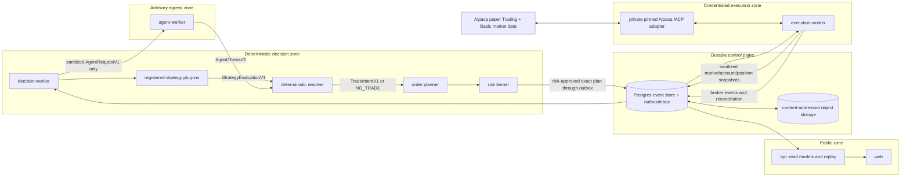

# System architecture

Status: proposed normative design, v1 draft

Scope: hackathon paper system; no live-trading path

## 1. Architectural outcome

Build a modular monolith from one repository and deploy it as isolated roles:

- `web`: credential-free, read-only judge dashboard.
- `api`: public read models and replay endpoints plus server-sent events or WebSocket updates; no mutation route, broker secret, or control authority.
- `decision-worker`: deterministic strategy/order-planning/risk pipeline; no competition broker secret and no order tools.
- `agent-worker`: internal-only advisory adapter; it receives a sanitized semantic context/evaluation pair plus one provider key, and may return only a frozen allow-unchanged/veto thesis.
- `execution-worker`: sole Alpaca-credentialed role; collects broker-authoritative snapshots, submits only immutable approved plans, and reconciles orders/positions.
- `operator-cli`: a private, one-shot administrative client used only by named operators to arm or halt; it is not deployed in the public API or judge UI.

The monolith keeps the delivery surface small while package and process boundaries make future extraction possible. Scalability comes from stable contracts, idempotent consumers, immutable artifacts, and replaceable adapters—not from adding microservices during a seven-day build.

## 2. Non-negotiable invariants

1. There is no `LIVE` mode, live hostname, or live credential in the system.
2. Strategy plug-ins never receive network, filesystem, model, database, account, or broker objects.
3. An AI output is advisory. Competition V1 can only leave a deterministic proposal unchanged or veto it; confidence is diagnostic and cannot alter executable fields. AI cannot create exact legs, prices, quantities, templates, horizons, or risk limits.
4. Authorization order is:

   ```text
   semantic intent
   → exact immutable OrderPlanV1
   → final RiskDecisionV1 bound to one RiskInputV1 hash, expiry, and full authorization context
   → execution-side invariant replay
   → broker submission
   ```

5. Changing any leg, quantity, price, time in force, account/snapshot version, or client order ID creates a new plan hash and requires new approval.
6. An uncertain submission is reconciled by deterministic `client_order_id` before any retry.
7. Only the execution worker holds the competition Alpaca key/secret. Tool filtering is defense in depth, not the credential boundary.
8. Every transition is append-only and traceable to frozen inputs. `NO_TRADE` is a valid, visible result.
9. Stale/missing/crossed data, entitlement mismatch, unknown broker state, or reconciliation drift fails closed.
10. Research, shadow, Alpaca account-reported paper, and conservative shadow evidence remain separate. No layer is called the official contest score without an organizer formula.

## 3. Runtime topology and trust boundaries



Alpaca Trading API credentials also authenticate market data and are not proven read-scoped. Therefore the competition credential must not be placed in the decision worker merely to fetch quotes. The credentialed execution role publishes schema-limited `MarketSnapshotV1`, `AccountSnapshotV1`, and `PositionSnapshotV1` records. A separate research exporter may use a development paper account and only approved free-tier market-data endpoints, but it never receives the competition account key and its output is frozen before strategy code consumes it.

## 4. Required package dependency graph

```text
strategy_plugins → strategy_sdk → contracts
agent ─────────────────────────→ contracts
agent_worker → agent + contracts
decision_core → strategy_sdk + agent + contracts
strategy_runner → strategy_sdk + contracts
order_planner → contracts + domain
risk_kernel → contracts + domain
operator_cli → contracts + domain + least-privilege control procedure

decision_worker → decision_core + strategy_runner + order_planner + risk_kernel + ledger
execution_worker → execution_core + risk_kernel + market_data + object_store + alpaca_execution_mcp + ledger

execution_worker -X-> agent / strategy_sdk / strategy_plugins / order_planner
strategy_plugins -X-> adapters / risk_kernel / execution / apps / databases
decision_worker -X-> alpaca_execution_mcp / competition credentials
operator_cli -X-> outbox / execution adapter / broker credentials / arbitrary database writes
```

Enforce forbidden edges with architecture/import tests and distinct dependency sets. The decision-worker container image must not contain a provider client, execution adapter, or competition secret; the agent-worker image must not contain planner, risk, or broker packages; the execution-worker image must not contain model or strategy packages. A strategy plug-in executes only through `strategy_runner`: a separate process with canonical JSON stdin/stdout, a cleared environment, no network namespace, a minimal read-only filesystem, no inherited file descriptors, and CPU, memory, output-size, and wall-time limits. V1 loads only repository-owned, registry-pinned plug-ins; failure to establish this isolation is a deployment blocker, not a warning.

## 5. Target repository structure

```text
/
├── apps/
│   ├── api/
│   ├── decision_worker/
│   ├── execution_worker/
│   ├── operator_cli/              # private one-shot arm/halt client
│   └── web/
├── packages/
│   ├── contracts/                 # Pydantic models for contract family V1; no I/O
│   ├── domain/                    # canonical hashing and state machines
│   ├── strategy_sdk/              # public plug-in API
│   ├── strategy_runner/           # isolated canonical-JSON plug-in process
│   ├── decision_core/             # strategy + advisory resolver
│   ├── agent/                     # frozen AgentThesisV1 adapter
│   ├── order_planner/             # exact contract/quantity/limit planning
│   ├── risk_kernel/               # pure risk decisions and hard preflight
│   ├── market_data/               # normalized snapshot contracts/adapters
│   ├── ledger/                    # event store, outbox/inbox, read models
│   ├── execution_core/            # broker command state machines
│   ├── alpaca_execution_mcp/      # private pinned MCP adapter
│   └── object_store/
├── strategy_plugins/
│   ├── always_no_trade_v1/
│   └── regime_momentum_v1/
├── schemas/v1/                    # committed JSON Schema snapshots
├── configs/
│   ├── strategy_registry.yaml
│   ├── template_catalog.yaml
│   └── risk/
├── research/                      # manifests, reports, code; no secrets
├── tests/
│   ├── architecture/
│   ├── contract/
│   ├── property/
│   ├── replay/
│   ├── security/
│   ├── integration/
│   └── e2e/
├── docs/
├── infra/
├── AGENTS.md
├── CONTRIBUTING.md
├── SECURITY.md
├── pyproject.toml
└── uv.lock
```

This is the target skeleton, not permission to scaffold every directory before the fixture vertical slice needs it.

## 6. Domain contracts

All money and executable prices use decimal strings; quantities are integers; timestamps are UTC RFC 3339; models reject unknown fields. Pydantic models generate JSON Schema, and frontend types are generated from the API schema.

Core immutable payloads:

| Contract | Producer | Consumer | Key guarantee |
|---|---|---|---|
| `MarketSnapshotV1` | Execution-zone market ingress or frozen research exporter | Features, strategy, planner | Point-in-time data, feed/entitlement, freshness, quality, content hash |
| `AccountSnapshotV1` | Execution worker | Decision/risk through sanitized view | Versioned equity, cash, buying power; no credential |
| `PositionSnapshotV1` | Execution worker | Decision/risk/dashboard | Broker-authoritative leg-level positions and snapshot version |
| `OrderRiskSnapshotV1` | Reconciler/ledger projection | Risk/preflight/control | Versioned working/pending/unknown broker orders plus unexpired approved-but-nonterminal risk reservations and remaining quantities |
| `FeatureVectorV1` | Feature package | Strategy plug-in | Exact inputs, availability time, calculation version and hash |
| `StrategyEvaluationV1` containing `StrategyDecisionV1` | Isolated registered plug-in | Deterministic resolver | Semantic `NO_TRADE`, template request, or logical position directive plus provenance; never an exact order |
| `AgentThesisV1` | Agent adapter | Deterministic resolver | Frozen allow-unchanged/veto artifact bound to context, strategy evaluation, model input, and expiry; its structured market thesis/counter-thesis/explanation is display-only and confidence is diagnostic only |
| `TradeIntentV1` | Resolver | Order planner | Allowed semantic direction/template/risk request and provenance |
| `OrderPlanV1` | Order planner | Risk, execution | Exact legs, quantity, limit, TIF, deterministic ID and canonical hash |
| `RiskInputV1` | Decision worker | Risk kernel/execution preflight | Canonical plan, market/account/position/order-risk hashes, risk policy, template catalog, strategy registry/config/content, mode, account allowlist, and release hash |
| `RiskDecisionV1` | Risk kernel | Execution worker | Approval/rejection bound to exact `risk_input_hash` with TTL |
| `ExecuteApprovedPlanV1` | Decision worker outbox | Execution worker inbox | Immutable plan plus approval, identical `risk_input_hash`, provenance, and one command hash |
| `ExecutionPreflightDecisionV1` | Execution worker | Ledger/broker adapter | Independent allow/reject decision bound to command hash and latest reconciled state immediately before submission |
| `ArmCommandV1` / `HaltCommandV1` | Private operator CLI | Least-privilege control procedure | Single-use CAS transition bound to nonce, expiry, expected mode/version, account, release, config/policy hashes, and operator identity |
| `BrokerEventV1` | Execution worker | Ledger/read model/reconciler | Accepted/rejected/unknown/partial/fill/cancel/expiry with leg data |
| `RunManifestV1` | Orchestrator | Evidence/replay | Git/config/schema/plugin/data/model hashes and result status |

Every event is wrapped in `EventEnvelopeV1` with `event_id`, `event_type`, `schema_version`, `aggregate_id`, monotonic `aggregate_version`, `occurred_at`, `received_at`, `producer`, `run_id`, `correlation_id`, `causation_id`, and payload.

## 7. Event and state flow

Decision aggregate:

```text
EvaluationRequested
→ MarketSnapshotRecorded
→ FeatureVectorComputed
→ StrategyDecisionProduced
→ AgentThesisFrozen
→ TradeIntentResolved | NoTradeRecorded
→ OrderPlanCreated
→ RiskRejected | RiskApprovedAndCapacityReserved
→ ExecuteApprovedPlanEnqueued
```

Execution aggregate:

```text
ExecutionCommandClaimed
→ ExecutionPreflightRejected
| ExecutionPreflightApproved → OrderSubmissionStarted
→ OrderAccepted | OrderSubmissionUnknown | OrderRejected
→ OrderPartiallyFilled*
→ OrderCancelRequested? → OrderCancelled | OrderExpired | OrderFilled
→ PositionReconciled | ReconciliationRequired
```

System operation:

```text
DISARMED → REPLAY → SHADOW → PAPER_DEMO_ARMED / PAPER_ARMED
                                      ↓ hard stop with exposure
                                  FLATTENING → HALTED
```

Only `PAPER_DEMO_ARMED`/`PAPER_ARMED` permit entries or exposure increases. `FLATTENING` and `HALTED` permit only typed cancel-by-ID and reduce-only exit commands that are independently proven not to increase worst-case exposure. A hard stop with working orders or positions enters `FLATTENING`; after broker-confirmed flat reconciliation it enters `HALTED`. A restart in either state reconciles first and may continue only risk reduction. There is no automatic path back to an armed state and no `LIVE` state.

## 8. Consistency, idempotency, and concurrency

- Postgres is the runtime source of truth; object storage contains immutable large artifacts and content-addressed evidence.
- Use a transactional outbox for risk-approved plans and an execution inbox with deduplication.
- Under the account-level lock, build the prospective `OrderRiskSnapshotV1` containing the proposed reservation, evaluate/bind that prospective hash in `RiskInputV1`, then CAS the prior order-risk version and atomically persist the prospective snapshot, approval, reservation, and outbox command. Competition V1 permits at most one nonterminal exposure-increasing reservation/order per account; a second approval waits for terminal broker reconciliation or fails CAS.
- Commit the strategy evaluation event, compare-and-swap of prior state sequence/hash, and next-state record in one database transaction. The registry pins the allowed state schema version and schema hash; a mismatch returns a stable refusal.
- Require unique `(account_id, client_order_id)` and `(intent_id, plan_hash)` constraints.
- Use an account-level lease/advisory lock so two execution replicas cannot submit simultaneously.
- Delivery may be at least once; broker effect must be exactly once through deterministic client IDs plus reconciliation-before-retry.
- Persist every leg fill and re-run position/risk reconciliation after partial or terminal transitions.
- Approved-but-unsubmitted, accepted-unfilled, partially filled, and unknown submissions retain conservative remaining-quantity reservations. Release or convert reservation capacity only through reconciled terminal/fill events; unknown state remains fully reserved.
- A repriced order is a new exact plan, hash, risk decision, and client order ID lineage—not a mutation of approved content.
- Dashboard read models are projections; they can be rebuilt from the event stream and must never become order authority.

### Operator state control

`ArmCommandV1` and `HaltCommandV1` contain `command_id`, unique nonce, issued/expiry timestamps, operator identity/auth context, expected current mode and aggregate version, target mode, expected account allowlist hash, release hash, config/risk-policy hash, latest broker-reconciliation hash/version/time, reason code, and canonical command hash. They are single-use and replay-safe.

The private operator database role may `SELECT` only the current control/release/reconciliation projection and `EXECUTE` one versioned `apply_control_command_v1` procedure. It has no direct table DML, event/outbox/inbox privileges, broker secret, or execution-network route. The procedure verifies expiry, unique nonce, hashes, legal transition, compare-and-swap version, and a broker reconciliation no older than 15 seconds that shows the expected account, flat positions, and no working/pending/unknown orders before arming; then it atomically records the command/audit event and control state. `PAPER_ARMED` requires the exact active plug-in to be `paper_enabled`; `PAPER_DEMO_ARMED` requires `paper_demo_only` plus its tiny demo profile. A halt with open orders/exposure targets `FLATTENING`, not an entry-capable state. Tests cover stale/replayed, wrong-account, wrong-release/config/reconciliation, nonflat/unknown-order, lifecycle/mode mismatch, illegal-mode, and concurrent commands.

## 9. Execution-side independent preflight

Before submitting even a schema-valid, hash-verified `ExecuteApprovedPlanV1`, the execution worker emits an `ExecutionPreflightDecisionV1` after repeating hard invariants:

- an entry/increase command is allowed only in `PAPER_ARMED` or narrowly `PAPER_DEMO_ARMED`; `FLATTENING`/`HALTED` accept only typed cancel-by-ID or reduce-only exits whose recomputed worst-case exposure cannot increase;
- paper hostname and expected account ID match the deployment allowlist;
- recompute `risk_input_hash` over the plan, market/account/position/order-risk hashes, risk policy, template catalog, strategy registry/config/content, mode, account allowlist, and release; command and approval must bind that identical value;
- command and approval hashes match the immutable payload and deployed allowlist, and approval TTL is still valid;
- quote age is recomputed against the submission clock and remains inside the template TTL;
- account, position, and order-risk snapshot versions exactly equal the latest broker-reconciled/reservation versions; a newer version or any mismatch requires a new plan and approval;
- strategy plug-in/version/hash and template are enabled in the central registry;
- underlying is in the deployment allowlist;
- plan is defined-risk, quantities/ratios are valid, and there is no naked short leg;
- maximum loss, cluster exposure, daily capacity, and current reconciled state pass;
- quote age and market clock remain valid;
- deterministic client order ID is not already terminal or uncertain.

Failure produces a stable rejection event and no broker mutation. Preflight success is single-use and bound to the command hash; it cannot authorize a modified or later command.

Swapping any sibling authorization value and recomputing only the outer command hash must still fail because the risk approval is bound to `risk_input_hash`.

## 10. Free-tier market-data architecture

All runtime/research artifacts record `source`, `feed`, `entitlement`, `event_time`, `available_time`, `requested_at`, and quality flags.

Team baseline:

- equities: Alpaca Basic IEX;
- options: Alpaca indicative feed, not OPRA;
- historical calls: centrally throttled and cached within the documented free-tier limit;
- historical options: coverage begins February 2024;
- recent-window restrictions and delayed indicative option trades are never relabeled as real-time OPRA evidence.

One ingestion service owns pagination, retry/backoff, rate limits, immutable cache keys, and manifests. Strategies consume normalized snapshots only. When the free feed lacks defensible Greeks or quotes, use premium/worst-case-loss and moneyness logic or abstain.

## 11. Deployment topology

Preferred hackathon deployment:

```text
Vercel web
    ↓ HTTPS/SSE
container PaaS: api + decision-worker + agent-worker + execution-worker as separate roles/images
    ↓
managed Postgres + S3-compatible persistent object storage
```

The exact container PaaS is an implementation choice. Requirements are public HTTPS, persistent file-mounted secrets, independent role scaling/restart, health checks, provider-only advisory egress, outbound Alpaca paper access, managed database connectivity, and logs. The public app is credential-free and read-only; replay mode works while markets are closed. Its database identity has `SELECT` only on dedicated read-model views and no access to event, outbox, inbox, credential, or control tables. Arming and halting use the private `operator-cli` or a one-shot private job with the command/procedure boundary above; there is no control endpoint in the public API deployment. Negative authorization tests must prove the public role cannot insert, update, delete, call privileged procedures, or reach the execution network.

## 12. Scaling path

Do not scale by increasing order concurrency first. Scale safely in this order:

1. Add decision-worker replicas partitioned by `strategy_id`/universe while preserving one account-level execution lease.
2. Partition event/read-model data by account, run, and date.
3. Extract market ingestion behind `MarketDataPort` only when load justifies it.
4. Extract the execution worker as an independently deployed service without changing the event contract.
5. Add a real job queue only if Postgres outbox polling is measurably insufficient.
6. Add another broker only behind a new adapter after the hackathon; do not weaken domain contracts to the least common denominator.

## 13. Architecture acceptance gate

The skeleton is acceptable only when all are true:

- Forbidden import edges fail CI.
- Strategy plug-ins compile/test without any Alpaca package or credential and execute only through the resource-limited, no-network `strategy_runner` boundary.
- Decision image contains no execution adapter or competition secret.
- Agent image contains only the provider adapter, contracts, and one file-mounted provider key; it has no execution, planner, risk, or broker dependency.
- Execution image contains no LLM or strategy plug-in package.
- Public API runs with a `SELECT`-only read-model database role; negative tests prove it cannot arm, halt, mutate control state, or enqueue work.
- Operator CLI has only control-projection `SELECT` plus exact procedure `EXECUTE`; stale, replayed, wrong-account/release/config, illegal-mode, and concurrent control commands fail.
- Golden fixture replay produces identical downstream plan/risk hashes from frozen market and thesis inputs.
- Duplicate execution commands cause one broker effect in the fake adapter.
- Unknown submission reconciles before retry.
- Any plan change invalidates approval.
- Forged/tampered commands, excess-risk commands, stale quotes, or non-latest account/position versions fail execution preflight without a broker call.
- A policy/catalog/registry/mode/account/release swap fails even when an attacker recomputes the outer command hash, because approval binds the full `risk_input_hash`.
- Concurrent approvals, approved-but-unsubmitted plans, accepted-unfilled orders, partial fills, and unknown submissions cannot overbook risk capacity; conservative reservations remain until reconciled conversion/release.
- Hard stop/restart fixtures with working orders, open spreads, partial fills, and orphan legs allow only cancel-by-ID/reduce-only actions through `FLATTENING`/`HALTED` until flat.
- Local startup fails on live hostname, unexpected account, missing allowlist, or non-ARM64 developer runtime. Deployment images declare and test their chosen native Linux architecture separately; managed Linux is not assumed to be ARM64.
- Public replay renders the complete decision tape without credentials.

Implementation sequencing is defined in [`../plans/SKELETON_IMPLEMENTATION_PLAN.md`](../plans/SKELETON_IMPLEMENTATION_PLAN.md); the strategy boundary is defined in [`STRATEGY_API.md`](STRATEGY_API.md).
