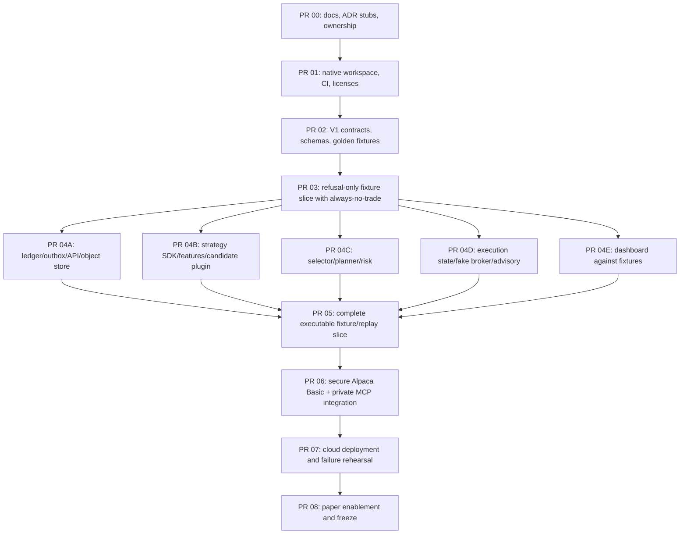

# Skeleton implementation plan

Status: delivery plan, v1 draft

Goal: turn the empty repository into a secure, replayable vertical slice that accepts any conforming strategy plug-in

## 1. Definition of the skeleton

The skeleton is complete when one command can run this flow entirely from committed fixtures:

```text
frozen market/account/position/order-risk snapshot
→ normalized features
→ registered strategy plug-in
→ frozen advisory thesis
→ deterministic semantic intent or NO_TRADE
→ exact option order plan
→ final risk decision and atomic reservation bound to full RiskInputV1 hash
→ Postgres outbox/inbox
→ fake broker submission/reconciliation
→ append-only event/read model
→ public decision-tape dashboard
```

The same contracts must then support Alpaca Basic market data and private paper execution without changing strategy code.

The skeleton is **not** six services, a production trading platform, a notebook collection, or permission to submit a judged-account trade before the research and paper gates pass.

## 2. Build principles

- Merge a thin end-to-end fixture slice before broad module depth.
- Freeze interfaces and golden JSON fixtures so owners can work without waiting for live Alpaca.
- Keep one repository and four deployment roles; enforce package/process boundaries in tests.
- Make unsafe states unrepresentable where possible and fail closed everywhere else.
- Use an `always_no_trade_v1` reference plug-in so infrastructure never depends on discovering alpha.
- Use fake/recorded adapters for development; the competition account is not an integration-test environment.
- Persist immutable artifacts/object storage from Day 1; an ephemeral container disk is not evidence storage.
- Pin every runtime, SDK, MCP version, schema, config, and plug-in hash.
- Preserve Alpaca account-reported paper P&L separately from conservative shadow/research results; do not call it the official contest score.

## 3. Six-person implementation ownership

| Person | Primary modules | First deliverable | Required reviewer |
|---|---|---|---|
| 1 — quant/product lead and release captain | Contracts, ADRs, registry, integration, scope, release gates | Approved V1 schemas, fixtures, dependency DAG, issue board | Person 6 plus consuming owner |
| 2 — data/backend platform | Ledger, Postgres outbox/inbox, object store, normalized ingestion, read-only API, private operator CLI, backend deployment | Event backbone and frozen snapshot ingestion | Person 3 |
| 3 — alpha/research | `strategy_sdk` consumer, isolated runner, H1 plug-in, feature code, evidence adapter | `always_no_trade` conformance plus runner isolation and candidate replay fixtures | Person 4 |
| 4 — options/risk | Template catalog, selector, order planner, pure risk kernel | Exact-plan and maximum-loss property tests | Person 5 |
| 5 — agent/execution | Advisory adapter, execution state machine, fake broker, private Alpaca MCP adapter, reconciliation | Approved-plan-to-fake-fill lifecycle and unknown-submit test | Person 4 |
| 6 — product/frontend/submission | Generated client, decision tape, replay UX, public deployment, demo assets | Dashboard rendering golden approved/rejected/no-trade traces | Person 1 |

Cross-cutting changes use the owner plus a non-author reviewer. Risk/execution and contract changes never self-merge.

## 4. Planned repository skeleton

Create directories only as their first vertical-slice code lands:

```text
apps/{api,decision_worker,execution_worker,operator_cli,web}
packages/{contracts,domain,strategy_sdk,strategy_runner,decision_core,agent,order_planner,risk_kernel,market_data,ledger,execution_core,alpaca_execution_mcp,object_store}
strategy_plugins/{always_no_trade_v1,regime_momentum_v1}
schemas/v1
configs/risk
research
tests/{architecture,contract,property,replay,security,integration,e2e}
infra
docs
```

Normative dependency rules are in [`../architecture/SYSTEM_ARCHITECTURE.md`](../architecture/SYSTEM_ARCHITECTURE.md); plug-ins follow [`../architecture/STRATEGY_API.md`](../architecture/STRATEGY_API.md).

## 5. PR and dependency sequence



Short-lived branches should contain one reviewable contract or behavior. Do not let five parallel branches invent competing copies of domain models.

## 6. Phase 0 — interface freeze

Owner: Person 1. Review: every consumer owner.

### Deliverables

- Confirm root plan/team decision register.
- Record ADR stubs for modular monolith, credential boundary, outbox/inbox, plug-in API, and frozen replay.
- Define `EventEnvelopeV1`, market/account/position/order-risk snapshots, feature vector, strategy evaluation, thesis, intent, exact plan, `RiskInputV1`, risk decision, reservation events, `ExecuteApprovedPlanV1`, `ExecutionPreflightDecisionV1`, `ArmCommandV1`, `HaltCommandV1`, broker event, and run manifest.
- Define stable reason-code namespaces.
- Define canonical JSON serialization and SHA-256 hashing.
- Commit golden fixtures for:
  - valid/fresh market snapshot;
  - stale/missing/crossed option quote;
  - `NO_TRADE` strategy result;
  - approved debit-spread plan;
  - risk-rejected oversized plan;
  - partial fill, unknown submit, cancel race, and final reconciliation.
- Freeze public read-model fields and initial dashboard wireframe.
- Assign names to Person 1–6 and every issue/PR reviewer.

### Gate

All consumers can implement against fixtures without importing another unfinished module. Unknown JSON fields fail. Decimal/timestamp/hash rules have executable examples.

## 7. Phase 1 — native workspace and CI

Owner: Person 2. Review: Person 1.

### Native Apple Silicon policy

Before selecting a local runtime:

- verify the package manager executable itself is ARM64;
- prefer `/opt/homebrew/bin/uv` and an explicit uv-managed `macos-aarch64` interpreter;
- record the literal interpreter path and require `platform.machine() == "arm64"`;
- use a separate ARM-only `UV_PYTHON_INSTALL_DIR`;
- audit native compiled extensions when Polars/NumPy/other compiled packages land;
- verify Node/container tooling is native where applicable;
- stop if any required dependency lacks a native Apple Silicon build—never fall back to Rosetta, `/usr/local/Homebrew`, `/Users/lipengyuan/anaconda3`, or an x86 uv cache.

Do not invoke ambient `python` merely because it has the desired version. The bootstrap evidence must include manager path/architecture, interpreter path/architecture, and compiled-extension architecture.

### Deliverables

- Root `pyproject.toml` as a uv workspace with pinned Python and separate role dependency groups.
- Native lockfile only after ARM verification.
- TypeScript workspace for `apps/web`, generated API client location, and native lockfile.
- Ruff, mypy/Pyright, pytest, import-boundary checks, TypeScript typecheck/lint/test, secret scanning, dependency audit, license check, and container build in CI.
- MIT license, contribution rules, security policy, `.env.example` containing names only, and secret-safe logging rules.
- Multi-stage role images so each contains only its dependency set.
- Architecture tests proving forbidden packages cannot import.

### Gate

A clean native ARM64 developer checkout passes lint/type/unit/architecture checks. Each Linux deployment image is built and tested for the container platform's explicitly selected native architecture, which may be ARM64 or AMD64; local Apple Silicon policy does not imply the managed Linux architecture. No secret or live endpoint exists in source/config/image.

## 8. Phase 2 — contracts and refusal-only fixture slice

Owner: Person 1 integrates; Persons 2–6 each own their adapter edge.

### Minimum implementation

1. Load a frozen `MarketSnapshotV1` and sanitized account/position fixtures.
2. Compute a versioned `FeatureVectorV1`.
3. Execute `always_no_trade_v1` only through the isolated runner and central registry.
4. Atomically persist the strategy evaluation event, prior-state compare-and-swap, and next state.
5. Record `NoTradeRecordedV1`, project the public read model, and render the refusal tape.
6. Replay the same fixtures and reproduce evaluation/state/event hashes.

### Gate

One command produces a complete immutable refusal trace from fixtures. A second run is idempotent. No model, network, broker, order plan, or credential is required. Malicious runner fixtures cannot access network, ambient environment, writable project files, or unbounded resources.

## 9. Phase 3 — parallel module work

Begins only after Phase 2 fixtures and contracts merge.

### Workstream A — data, ledger, API, storage

Owner: Person 2. Review: Person 3.

- Postgres migrations for events, outbox, inbox, artifact index, projections, and execution lease.
- Unique `(account_id, client_order_id)` and `(intent_id, plan_hash)` constraints.
- Content-addressed object store adapter and immutable manifest writer.
- Central rate limiter, pagination, retry/backoff, and free-tier cache.
- Normalization for Alpaca IEX/indicative feed identity and time/quality flags.
- Public read-only endpoints:
  - `GET /v1/status`
  - `GET /v1/runs`
  - `GET /v1/decisions/{decision_id}`
  - `GET /v1/pnl`
  - `GET /v1/replay/{run_id}`
  - read-only event stream
- A dedicated public database role with `SELECT` only on purpose-built read-model views; it has no event/outbox/inbox/control-table privileges.
- Private `operator-cli` or one-shot job for arm/halt actions. Its role has only control/release/reconciliation-projection `SELECT` and `EXECUTE` on one versioned CAS procedure—no direct DML, event/outbox/inbox access, broker secret, or execution-network route. Arming binds a reconciliation no older than 15 seconds and requires the expected account, flat positions, and no working/pending/unknown orders.
- No public trade/arm/halt/account-mutation endpoint or privileged stored procedure.

Gate: migrations round-trip; projections rebuild from events; incomplete pagination/feed mismatch fails; object artifact hash verifies. Negative authorization tests prove the public API cannot insert/update/delete, enqueue work, call privileged procedures, or reach execution networking. Operator tests reject expired/replayed nonce, wrong account/release/config/reconciliation, stale/nonflat/working-or-unknown-order state, illegal or concurrent CAS commands, `PAPER_ARMED` without `paper_enabled`, and `PAPER_DEMO_ARMED` without `paper_demo_only` plus the demo profile.

### Workstream B — strategy SDK and research plug-ins

Owner: Person 3. Review: Person 4.

- Implement `StrategyPluginV1` and conformance harness.
- Implement the production-equivalent isolated runner with canonical JSON IPC, cleared environment, network denial, minimal read-only filesystem, no inherited descriptors, and CPU/memory/output/time limits.
- Package `always_no_trade_v1`.
- Implement versioned H1 features and candidate plug-in only after the research manifest freezes.
- Central registry validation, content-hash pinning, lifecycle/mode checks.
- Determinism, no-I/O, no-forbidden-import, stale-data, and output-shape tests.

Gate: plug-in cannot represent exact-order fields, access services, or widen supplied allowlists; repeated input produces canonical-identical output. Malicious fixture plug-ins prove each runtime isolation control and fail with a stable reason code.

### Workstream C — options selector, planner, and risk kernel

Owner: Person 4. Review: Person 5.

- Template catalog with long call/put and debit vertical V1.
- Deterministic eligible-chain selector with DTE/moneyness/free-feed fallback and stable rejection codes.
- Exact multi-leg limit-plan builder, canonical hash, deterministic client ID, exit plan.
- Pure risk engine: maximum loss, daily capacity, cluster exposure, stale data, quote quality, market clock, account/position versions, duplicate intent, approval TTL.
- Property tests over price/strike/quantity/ratio edge cases.

Gate: no approved plan can exceed limits or contain naked/orphan legs; any exact-plan mutation requires new approval.

### Workstream D — advisory and execution

Owner: Person 5. Review: Person 4.

- Schema-limited `ModelPort` and frozen `AgentThesisV1`; default deterministic fixture provider.
- Provider-neutral adapter; optional Featherless experiment behind a flag only after the core passes.
- Separate execution aggregate/state machine.
- Fake broker supporting accepts, rejects, partial fills, timeouts, unknown results, cancel races, expiries, and reconciliation.
- Execution-side independent hard preflight.
- Normative prospective `OrderRiskSnapshotV1` containing the proposed reservation and `RiskInputV1` hash covering the plan, market/account/position/prospective-order-risk hashes, risk policy, template catalog, strategy registry/config/content, mode, account allowlist, and release. CAS the prior order-risk version and atomically persist the prospective snapshot, approval, reservation, outbox command, and identical `risk_input_hash`. V1 allows one nonterminal exposure-increasing reservation/order per account.
- Normative `ExecuteApprovedPlanV1` command containing the immutable plan, exact risk approval, `risk_input_hash`, snapshot provenance, and command hash.
- Normative `ExecutionPreflightDecisionV1` created immediately before submission and bound to the command hash and latest reconciled account/position/order-risk state.
- Private pinned Alpaca MCP adapter interface, initially fake/recorded.
- Account-level lease, inbox dedupe, reconciliation-before-retry, leg-level fills.

Gate: duplicate/unknown commands never duplicate broker effect; execution rejects stale approval/account mismatch/live host independently. Forged/tampered commands, swapped policy/catalog/registry/mode/account/release values, excess-risk plans, stale quotes, or non-latest account/position/order-risk versions produce no broker call and require replan/reapproval. Concurrent approvals, accepted-unfilled orders, and unknown submissions cannot double-spend capacity. Hard-stop/restart fixtures with working orders, positions, partial fills, and orphan legs permit only cancel-by-ID/reduce-only actions through `FLATTENING`/`HALTED` until flat.

### Workstream E — web and submission experience

Owner: Person 6. Review: Person 1.

- Generate client from the frozen API schema.
- Build decision tape: observation → strategy → thesis → intent → exact plan → risk → order/fill → reconciliation → exit.
- Distinct panels for Alpaca account-reported paper P&L, team-computed percentage return, conservative shadow, research evidence, risk, system state, and feed limitations.
- Replay mode with approved, rejected, no-trade, and failure fixtures.
- Credential-free public experience; no raw secrets/private account fields.
- External-browser smoke test and market-closed demo path.

Gate: dashboard works entirely against fixtures/read models and remains usable if Alpaca/model providers are unavailable.

## 10. Phase 4 — integrated replay system

Owner: Person 1. Review: all owners.

- Merge workstreams through contracts, never direct table/package shortcuts.
- Add the first executable fixture path: candidate strategy evaluation plus frozen independent advisory thesis → deterministic resolver → `TradeIntentV1` → selector/planner → exact `OrderPlanV1` → risk decision → `ExecuteApprovedPlanV1` → execution preflight → fake broker.
- Prove that strategy and advisory outputs are independent resolver inputs; neither can bypass the resolver or choose exact contracts, quantity, price, or risk limits.
- Require quote freshness at submission and exact equality with the latest reconciled account/position versions; any change forces replan/reapproval.
- Run the complete fixture corpus and rebuild projections from scratch.
- Add trace IDs across run/evaluation/intent/plan/approval/client order.
- Verify canonical hashes across Python processes and frontend display.
- Run chaos fixtures: stale data, missing leg, 429/5xx, malformed payload, worker restart, duplicate inbox row, DB retry, object-store failure, partial fill, unknown submit, and kill switch.
- Produce a single local/replay demo command and a clean-checkout runbook.

Gate: all acceptance scenarios are reproducible without network access and the public dashboard explains each refusal/failure. This is the first phase that claims a complete approved-plan-to-fake-fill vertical slice; PR 03 remains refusal-only.

## 11. Phase 5 — secure Alpaca integration

Owners: Person 2 for market data, Person 5 for execution, Person 4 for risk review.

### Read-side integration

- Use a development paper account for entitlement/contract tests; never the judged account.
- Explicitly request `feed=iex` and `feed=indicative` and record the observed entitlement.
- Centralize pagination/rate limiting/cache/manifests.
- Normalize rather than expose raw Alpaca responses.
- For the judged runtime, collect market/account/position data in the credentialed zone and publish sanitized snapshots; do not copy the competition key into the decision worker.

### Execution integration

- Pin the official Alpaca MCP version/tool schema and retain a tested adapter contract.
- Use separate private MCP configuration reachable only from the execution worker.
- Allowlist exact submit/get/cancel-by-ID/reconciliation operations in the private adapter; exclude broad arbitrary tools and generic cancel-all/close-all/exercise entirely. No Alpaca MCP package, transport, tool, configuration, or credential exists in the model/decision image.
- Start `DISARMED`; verify paper hostname, expected account ID, clean orders/positions, option level, MLeg behavior, and feed identity.
- Test preview/reject/partial/cancel/unknown/reconcile on a development account at minimal size.

Gate: no competition order yet. Development integration proves a full tiny order lifecycle, restart reconciliation, duplicate suppression, and kill switch with immutable evidence.

## 12. Phase 6 — cloud deployment

Owners: Persons 2 and 6. Review: Persons 1 and 5.

Preferred topology:

- Vercel: public web.
- Container PaaS: `api`, `decision-worker`, `execution-worker` as isolated roles/images.
- Managed Postgres: event/outbox/inbox/read models.
- S3-compatible object storage: immutable artifacts.

Requirements:

- public HTTPS application URL and credential-free replay;
- private network/secret separation for execution;
- role-specific identities and environment variables;
- public API database identity restricted to `SELECT` on read-model views, with no mutation/control route and no execution-network path;
- private one-shot operator CLI/job for single-use hash/nonce/expiry-bound arm/halt commands, separate from the public deployment and fully audited through its least-privilege procedure;
- health/readiness/liveness checks and explicit worker heartbeats;
- persistent migrations and object storage;
- log/trace retention without secrets;
- restart policy that reconciles before action: flat restarts return `DISARMED`; persisted `FLATTENING`/`HALTED` with exposure can perform only typed cancel-by-ID/reduce-only remediation until flat;
- rate limiting/authentication on nonpublic controls;
- external smoke test from a clean browser.

Gate: public replay and API work while market/model are unavailable; restart produces no new order; backend host is captured in the submission and organizer question log.

## 13. Phase 7 — paper enablement

Owner: Person 1 authorizes; Persons 4 and 5 jointly verify.

Preconditions:

- exact release, config, schema, template, risk, model/prompt, plug-in, and evidence hashes frozen;
- judged account is fresh, dedicated, $100,000, correct ID, flat, with no orders;
- Monday 09:30 ET baseline snapshot captured before first order;
- strategy registry says `paper_enabled` or distinct `paper_demo_only` with reviewer evidence;
- current chain/quote gates pass on Basic indicative data;
- paper hostname/account/live-absence checks pass independently in execution;
- loss/exposure/cluster limits, idempotency, reconciliation, kill switch, final flatten, and operator runbooks rehearsed;
- release captain records explicit arming event.
- `ArmCommandV1` binds the latest broker-reconciliation hash/version/time (no older than 15 seconds), expected flat positions, and zero working/pending/unknown orders inside the CAS procedure.

First action uses minimum risk and one atomic defined-risk options order. An unfilled order is not treated as an opened option position. Reconcile every transition before allowing another entry.

Gate: accepted/fill/position/reconcile evidence is complete, or the system returns safely to `DISARMED/HALTED` with no uncertain exposure.

## 14. Phase 8 — freeze and submission

- Freeze contracts, strategy API, candidate, symbols, parameters, prompt/model, templates, and risk policy.
- Permit operational defect fixes only, with owner/reviewer and new release hash.
- Stop new entries Thursday 13:30 ET; start programmatic flatten by 15:15 ET; require confirmed flat by 15:30 ET.
- Preserve Monday baseline and Thursday final account/order/fill/position/equity evidence.
- Publish dollar P&L, percentage return, and conservative shadow separately.
- Verify public app, replay, video, deck, cover, one-page write-up, repo, MIT license, account ID, and exact release.
- Submit by Friday 10:00 ET, not the 11:00 deadline.

## 15. Acceptance matrix

| Gate | Evidence | Owner | Reviewer |
|---|---|---|---|
| ARM64 | manager/interpreter/compiled-extension architecture record | Person 2 | Person 1 |
| Contracts | schema snapshots, golden fixtures, compatibility test | Person 1 | Consuming owners |
| Architecture | forbidden-import/image-content tests | Person 2 | Person 5 |
| Plug-in | conformance, determinism, production-equivalent isolation, registry hash | Person 3 | Person 4 |
| Vertical slice | full fixture event trace and dashboard replay | Person 1 | Person 6 |
| Risk | full `risk_input_hash`, exact-plan/context invalidation, cluster/daily gates | Person 4 | Person 5 |
| Execution | immutable command/preflight, context-swap/tamper/staleness rejection, flatten-only halt/restart, duplicate/unknown/partial/cancel reconciliation | Person 5 | Person 4 |
| Credential | decision image has no competition secret/order adapter; execution account/host gate | Person 5 | Person 1 |
| Public API | `SELECT`-only views and negative auth/network tests; control only through private operator job | Person 2 | Person 5 |
| Data | explicit feed, entitlement, time semantics, pagination, cache/manifests | Person 2 | Person 3 |
| Research | frozen evidence and independent promotion card | Person 3 | Person 4/non-author |
| Deployment | external replay smoke, restart/disarm, persistent evidence | Persons 2/6 | Person 1 |
| Paper | baseline, arming, tiny order lifecycle, kill/flatten rehearsal | Persons 1/5 | Person 4 |
| Submission | public/reproducible/secret-free exact release and assets | Person 6 | Person 1 |

## 16. Cut rules

Cut immediately if it threatens the vertical slice or safety boundary:

- second/fallback strategy before the champion pipeline passes;
- 0DTE profile;
- equity-plus-option two-order hedge template;
- historical IV/skew/Greek strategy without point-in-time free data;
- new model provider integration, including Featherless, after its one-hour optional timebox;
- Redis, Kafka, Kubernetes, service mesh, multi-broker support;
- arbitrary model-facing Alpaca tools;
- a dashboard feature without a read-model contract;
- Friday trading dependency.

The minimum successful submission is one auditable strategy or explicit demo-only path, one safe option fill, one genuine risk rejection, one deterministic replay, and a public explanation of what the system refuses to do.
