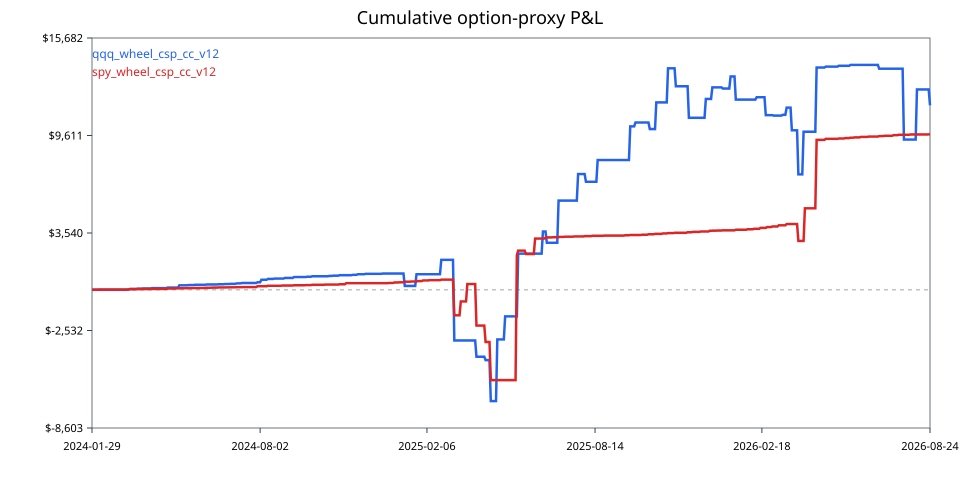

# Group A research plan — SPY and QQQ broad-tech controls

Status: independently shareable parallel research packet

Implementation commit: `cb03a7684fb67c6f0888333f6c3c2145e8645be9`

Dependency-lock hash: `sha256:b846dc0b4d52be240cbb131e8267a5bf5ed4659b21570573b9ea1d48dcc865cf`

Assigned capacity: one packet owner responsible for two independently versioned strategy families

Primary symbol cells: `SPY`, `QQQ`

Assigned strategies: normalized intraday continuation and normalized intraday VWAP reversion

## 1. Mission and authority boundary

Group A establishes the broad-market and large-cap technology reference results against which the specialized groups are compared. SPY is the broad-market/liquidity control; QQQ is the liquid technology benchmark and the parent control for TQQQ/IGV work.

The group owns the SPY/QQQ data-quality interpretation, feature specifications, both pure signal functions, plug-in packages, group cells, artifacts, and review. It does not own Alpaca ingestion, the central registry, option contract selection, sizing, risk approval, order submission, promotion, or judged-account operation.

Researchers work from a source snapshot plus immutable data artifacts. They need no GitHub write credential, Alpaca credential, account ID, broker access, MCP trading tool, deployment secret, or order permission. Return patches/source archives and content-addressed evidence to the platform owner.

A profitable report cannot self-promote. `integration/registry_candidate.yaml` is a non-authorizing proposal with lifecycle `research_only`; only central owners may later change registry authority after every research, integration, safety, and release gate passes.

The signal plug-in never calls an LLM. Any advisory AI may leave a frozen deterministic proposal unchanged or veto it to `NO_TRADE`; it cannot change direction, family, symbol ranking, template, horizon, strike policy, size, executable fields, or lifecycle.

## 2. Packet ownership and exact returns

- **Intraday-continuation deliverable:** `intraday_continuation_v1`, including its feature contract, pure signal, canonical plug-in, package-local offline reproduction script, SPY/QQQ pair-cell evidence, prescribed sensitivities, option-proxy status, falsifications, and complete artifact tree.
- **VWAP-reversion deliverable:** `vwap_reversion_v1`, including its separate feature contract, pure signal, canonical plug-in, package-local offline reproduction script, SPY/QQQ pair-cell evidence, prescribed sensitivities, option-proxy status, falsifications, and complete artifact tree.

The Group A packet owner authors both families but freezes both specifications before viewing outcome P&L for either family. A separate review-signoff gate is not required for this research-only packet: reproducible manifests, hashes, deterministic tests, and recorded negative fixtures are the required evidence. Any outcome-changing correction is versioned and requires affected runs to be repeated.

The packet owner may not modify the authoritative registry, install broker credentials, run private market-data downloads, enable paper mode, review their own packages, or approve their own promotion. Stop before work if the checkout or `uv.lock` differs from the pinned values above.

## 3. Exact universe and controls

| Use | Symbols | Rule |
|---|---|---|
| Owned research cells | SPY, QQQ | Complete data/signal/stress/falsification output for both; run option proxy only when the global blinded feasibility manifest selects the symbol. |
| Intraday-continuation compatibility | SPY, QQQ, TQQQ, SMH, SOXL, IGV | Group A freezes one implementation; central integration runs it unchanged on every compatible feasible symbol. |
| VWAP-reversion promotion-eligible compatibility | SPY, QQQ, SMH, IGV | Leveraged-ETF rows are diagnostic unless a separately frozen version changes that status before outcomes. |
| Broad-market control | SPY | QQQ results must report beta/correlation and active-date overlap with SPY. |
| Technology control | QQQ | QQQ supplies the benchmark inputs consumed by the TQQQ/IGV group; Group A may not tune either strategy to improve those downstream results. |
| Statistical null | All viewed candidates on common dates | Use the synchronized centered five-session moving-block maximum-statistic procedure; no per-trade sign permutation. |

This packet returns two separate strategy packages and their SPY/QQQ `pair_cell_metrics.json` files. Those files are diagnostic evidence only: the packet owner may not select SPY versus QQQ, declare a champion/fallback, or claim the pair is the complete `CandidateSpecV1`. After all six strategies freeze, the central quant/release owner expands both unchanged to their compatible feasible universe and writes `central_full_universe_replay.json`. That later replay alone applies cross-symbol arbitration and the family-wide selection test.

Before any alpha outcome is viewed, the data steward must sign `research/shared/selection/option_proxy_feasibility_manifest.json`, ranking all six symbols from blinded entitlement, completeness, timestamp, standard-contract, simultaneous-leg, and corporate-action fields. The global `selected_symbols` list has at most three symbols. SPY or QQQ absent from it still receives full underlying research, but its option artifacts are empty schema-valid tables plus `option_proxy_not_selected.json` with exact status `NOT_SELECTED_BY_FEASIBILITY`. Group A cannot swap, rerank, or fill a slot after seeing results.

### 3.1 Frozen cross-symbol arbitration

For each decision time, compute every compatible symbol row with the same pure family function, then:

1. remove rows failing data, feature, session, family, cluster, cooldown, or existing-exposure gates;
2. rank remaining rows by `entry_score - 1.00`, where the central entry threshold is exactly `1.00`;
3. break an exact tie by `SPY, QQQ, TQQQ, SMH, SOXL, IGV` order;
4. map score `[1.00, 1.25)` to `LOW`, `[1.25, 1.75)` to `MEDIUM`, and `>= 1.75` to `HIGH`;
5. send only the winner as a semantic request; if later option/quote/risk checks fail, record `NO_TRADE` with no fall-through;
6. allow at most one new exposure-increasing intent per decision time and one nonterminal position/order;
7. treat QQQ/TQQQ/IGV as one technology cluster and SMH/SOXL as one semiconductor cluster;
8. retain every eligible, rejected, selected, and suppressed row with a reason code.

The pair-cell reproduction script records both per-symbol rows and does not arbitrate a winner. The later central adapter must use `packages/strategy_sdk/arbitration.py` at source-file SHA-256 `864fe5d419717bb424eb10ed54b5ad8ac5095bfc235d3f10a2d894e39826edd5`. Option P&L, spread width, current quote, and future coverage can never be alpha tie-breaks.

## 4. Alpaca free-tier data rules

The data steward collects and hashes all inputs using the [read-only Alpaca collector](ALPACA_DATA_COLLECTOR.md) and its frozen shared specification. Group A consumes only immutable artifacts with `status=COLLECTED` and a hash-bound deterministic feasibility manifest with `status=READY_FOR_REPLAY`; independent review is optional provenance, not a backtest gate.

Do not begin outcome-bearing work until `research/shared/entitlement_probe.json` confirms the approved free-tier endpoints, IEX/indicative feed behavior, requested dates, pagination, and access result. An unavailable or mismatched probe fails the data gate; it does not cause the researcher to request credentials or try another source.

- Underlying history: Alpaca stock bars with explicit `feed=iex`; never SIP, delayed SIP relabeled as IEX, or another vendor.
- Fetch raw-adjusted bars for point-in-time spot/strike matching and split-adjusted bars for continuous return features. Never pair a split-adjusted spot with a raw option strike.
- Historical option evidence: Alpaca option bars/trades only, labeled as non-executable proxies. Record `requested_feed=N/A_ENDPOINT_HAS_NO_FEED_PARAM` where the endpoint has no feed parameter.
- Current option readiness: Alpaca `feed=indicative` latest quotes/chains/snapshots only. Never call them OPRA, NBBO, or executable history.
- Consume all pagination tokens; persist endpoint/tool version, scrubbed query, requested/returned coverage, rate-limit/errors, row counts, source timestamps, adjustment type, schema hash, and raw/normalized hashes.
- No Yahoo, Polygon, Databento, Cboe/OPRA download, FRED, external news, hand-copied chain, or researcher-specific data patch.
- Missing or invalid source data produces a failed gate or `NO_TRADE`, not forward-fill, another feed, another symbol, or an invented price.

Every normalized row carries `event_time`, `available_time`, `ingested_at`, endpoint/tool, explicit feed or sentinel, source page token, and raw response hash. Features require both `event_time <= decision_time` and `available_time <= decision_time`.

## 5. Common clock and execution proxy

- Aggregate one-minute IEX bars into ET half-open 15-minute intervals. Open is first, high is maximum, low is minimum, close is last, volume is sum, and interval VWAP is volume-weighted minute VWAP.
- A missing minute, missing VWAP, or zero cumulative volume invalidates the decision interval.
- Label an interval by its end and set availability to `interval_end + 1 second`.
- Entry evaluations occur at 10:30:01, then every 30 minutes through 14:30:01 ET.
- The underlying execution proxy is the open of the first one-minute interval beginning on the next whole minute after the decision/exit time.
- Position age starts at confirmed proxy/runtime fill, never at signal time.
- No overnight positions, overlapping labels, or early-close sessions.
- Central time exit is 60 minutes from confirmed fill, capped at 15:45 ET. Diagnostics at 45 and 90 minutes cannot replace the central result.
- Evaluate open-position management after every completed 15-minute interval plus one second. For trend exits, bullish closes on `close <= session_vwap` and bearish on `close >= session_vwap`; for VWAP reversion, bullish closes on `close >= session_vwap` and bearish on `close <= session_vwap`.
- Strategy-level premium profit targets and price stops are disabled. Safety/reconciliation exits are recorded separately and never tuned as alpha exits.
- On the competition final Thursday, the target policy allows no new entry after 13:30 ET, begins flatten by 15:15, and requires broker-confirmed flat by 15:30. Research replays the rule through the pinned policy semantics; durable broker-confirmed flatten evidence remains release-owned and blocks paper use, not credential-free research.
- Plug-ins are entry-only. The central position manager owns exit orders and final flatten; the named policy decisions and reduce-only construction exist at the pinned commit, while durable broker/fill/restart/confirmed-flat proof remains a release-owned paper gate.

## 6. Normalized intraday continuation

At decision time `t`:

```text
r60_t = log(close_t / p_t_minus_60m)
momentum_z = (r60_t - mean_prior_20_same_time_r60)
             / max(sample_std_prior_20_same_time_r60, 1e-6)
```

At 10:30, `p_t_minus_60m` is the 09:30 session open. Otherwise it is the completed close exactly 60 minutes earlier. Never cross an overnight boundary.

Central signal:

- bullish when `momentum_z >= 1.00` and close is above completed session IEX VWAP;
- bearish when `momentum_z <= -1.00` and close is below completed session IEX VWAP;
- otherwise `NO_TRADE`.

Set `entry_score = abs(momentum_z)`. Target exit policy is `TREND_VWAP_OR_60M_V1`: adverse completed-close VWAP cross or the hard-time deadline.

Parameter budget:

- central threshold `1.00`, the only promotion-eligible value;
- diagnostic thresholds `0.75`, `1.25` one at a time;
- central time exit 60 minutes; diagnostic 45 and 90 minutes;
- no symbol-specific thresholds, time windows, regime overlays, news, IV, Greeks, or additional feature search.

## 7. Normalized VWAP reversion

At decision time `t`:

```text
deviation = log(close_t / session_vwap_t)
deviation_z = (deviation - mean_prior_20_same_time_deviation)
              / max(sample_std_prior_20_same_time_deviation, 1e-6)
```

Central signal:

- bullish when `deviation_z <= -1.50` and `abs(momentum_z) < 0.50`;
- bearish when `deviation_z >= 1.50` and `abs(momentum_z) < 0.50`;
- otherwise `NO_TRADE`.

Set `entry_score = abs(deviation_z) / 1.50`. Target exit policy is `REVERSION_VWAP_TOUCH_OR_60M_V1`: completed-close touch through session VWAP in the convergence direction or the hard-time deadline.

Parameter budget:

- central deviation threshold `1.50`, the only promotion-eligible value;
- diagnostic thresholds `1.25`, `1.75` one at a time;
- momentum-neutral gate fixed at `0.50` with no optimization;
- central time exit 60 minutes; diagnostic 45 and 90 minutes;
- VWAP reversion remains a standalone candidate, never a continuation overlay or intraday fallback.

Researchers may run the common intraday-continuation golden fixture on any supported Windows, Linux, or macOS platform. The central owner separately verifies native-ARM64 host compatibility before integration/paper promotion; architecture never blocks offline research.

## 8. Candidate and feature contracts

Create these complete candidate identities before viewing outcome P&L:

- `intraday_continuation__all_feasible__o2_v1`, with ordered eligible set `[SPY, QQQ, TQQQ, SMH, SOXL, IGV]`;
- `vwap_reversion__spy_qqq_smh_igv__o2_v1`, with ordered eligible set `[SPY, QQQ, SMH, IGV]`.

Each `CandidateSpecV1`-equivalent strategy card freezes:

```text
signal_family_id
ordered_eligible_symbol_set
feature_schema_hash
central_config_hash
O2_expression_and_template_catalog_hash
allocator_hash
position_policy_hash
base_cost_policy_hash
```

The required Group A feature contract includes versioned, namespaced definitions for at least:

- `<SYMBOL>__r60_v1`;
- `<SYMBOL>__momentum_z_60m_same_time_v1`;
- `<SYMBOL>__session_iex_vwap_v1`;
- `<SYMBOL>__close_completed_15m_v1`;
- `<SYMBOL>__deviation_log_from_session_vwap_v1`;
- `<SYMBOL>__deviation_z_same_time_v1`;
- session/early-close and source-quality flags.

Each entry states type, unit, exact formula, lookback, source/feed, event/availability rule, maximum age, missing behavior, allowed quality flags, and worked-example hash. Missing, stale, nonfinite, or schema-mismatched features produce `NO_TRADE`.

## 9. Exact package and integration handoff

The packet owner returns one canonical package per family, for two packages total. Substitute the corresponding plug-in ID in each tree; do not use the flat fixture layout currently present elsewhere in the repository:

```text
strategy_plugins/<plugin_id>_v1/
├── pyproject.toml
├── manifest.yaml
├── README.md
├── hypothesis.yaml
├── defaults.yaml
├── src/<plugin_id>_v1/
│   ├── __init__.py
│   ├── plugin.py
│   ├── signal.py
│   └── reason_codes.py
├── scripts/
│   └── reproduce.sh
├── tests/
│   ├── fixtures/
│   ├── golden/
│   ├── test_contract.py
│   ├── test_thresholds.py
│   ├── test_no_trade.py
│   ├── test_determinism.py
│   ├── test_boundary.py
│   └── test_parity.py
└── evidence/
    └── promotion.json
```

The separate research evidence tree is `research/candidates/<candidate_id>/` and contains `strategy_card.md`, `hypothesis.yaml`, `feature_contract.yaml`, `central_config.json`, `sensitivities.yaml`, `reason_codes.yaml`, `state_schema.json`, `data_refs.json`, `artifact_schema.json`, `runs/<run_id>/`, `integration/`, and `promotion_card.md`. Every run contains `run_manifest.json`, `pair_cell_metrics.json`, `signals.parquet`, `selected_contracts.parquet`, `proxy_leg_observations.parquet`, `trades.parquet`, `daily_returns.parquet`, `fold_metrics.parquet`, `metrics.json`, `cost_stress.json`, `limitations.md`, and plots. The deterministic reproduction record replaces `pair_cell_review.json`; central owners later add `central_full_universe_replay.json` outside the researcher's run.

### 9.1 Frozen integration cards

| Field | Intraday-continuation package | VWAP-reversion package |
|---|---|---|
| `plugin_id` / version | `intraday_continuation` / `1.0.0` | `vwap_reversion` / `1.0.0` |
| entry point | `intraday_continuation_v1.plugin:Plugin` | `vwap_reversion_v1.plugin:Plugin` |
| hypothesis ID | `NORMALIZED_INTRADAY_CONTINUATION` | `NORMALIZED_VWAP_REVERSION` |
| owner / evidence gate | assigned Group A owner / deterministic reproduction | assigned Group A owner / deterministic reproduction |
| pair-cell evidence | ordered `[SPY, QQQ]` | ordered `[SPY, QQQ]` |
| later compatibility | ordered `[SPY, QQQ, TQQQ, SMH, SOXL, IGV]` | ordered `[SPY, QQQ, SMH, IGV]` |
| position policy | `TREND_VWAP_OR_60M_V1` | `REVERSION_VWAP_TOUCH_OR_60M_V1` |
| allowed entry tuples | bullish call-debit and bearish put-debit; `INTRADAY_15_60M`, `TINY`, max TTL `300` | same |
| data requirements | `feature-vector/v1`; hash `CANDIDATE_DEFINED_AND_HASHED_BEFORE_OUTCOME_RUN`; maximum age `60`; logical positions `false` | same |

Both manifests use `api_version: strategy-plugin/v1`, `decision_schema_version: strategy-evaluation/v1`, `deterministic: true`, and `network_access: false`. Required feature keys are ordered by `SPY, QQQ, TQQQ, SMH, SOXL, IGV`, then lexicographically within symbol. Intraday continuation requires each compatible symbol's `close_completed_15m_v1`, `momentum_z_60m_same_time_v1`, and `session_iex_vwap_v1`; VWAP reversion requires `deviation_z_same_time_v1` and `momentum_z_60m_same_time_v1`. The packet owner freezes and hashes both complete candidate-specific contracts before viewing outcome P&L for either one; the release owner validates the key lists and hashes before integration review.

`central_config.json` is a canonical rendering of flat `StrategyConfigV1.values`. Exact intraday-continuation keys/values are `momentum_threshold="1.00"`, `same_time_lookback_sessions=20`, `std_floor="0.000001"`, `vwap_alignment_required=true`, `decision_start_et="10:30:01"`, `decision_end_et="14:30:01"`, `decision_step_minutes=30`, `max_entries_per_symbol_session=1`, `time_exit_minutes=60`, `risk_tier="TINY"`, and `intent_ttl_seconds=300`. Exact VWAP-reversion keys/values are `deviation_threshold="1.50"`, `momentum_neutral_abs_max="0.50"`, `same_time_lookback_sessions=20`, `std_floor="0.000001"`, the same decision clock/entry/time-exit keys, `risk_tier="TINY"`, and `intent_ttl_seconds=300`. Decimal thresholds are strings in JSON and become `Decimal` values in `StrategyConfigV1`.

### 9.2 Output, reason, and state rules

The pure `signal.py` function and `Plugin.evaluate()` use identical logic. A bullish entry emits `CALL_DEBIT_SPREAD_V1`; bearish emits `PUT_DEBIT_SPREAD_V1`; horizon is `INTRADAY_15_60M`, risk tier is `TINY`, expiry is exactly `context.as_of + 300 seconds`, and the sole evidence reference is the input `FEATURE_VECTOR`. Score buckets are `[1.00,1.25)=LOW`, `[1.25,1.75)=MEDIUM`, and `>=1.75=HIGH`. The plug-in emits `packages.strategy_sdk.UNBOUND_PLUGIN_CONTENT_HASH`; the host owns source-hash binding.

Common `NO_TRADE` codes are exactly `DATA_MISSING`, `DATA_STALE`, `DATA_QUALITY_REJECTED`, `FEATURE_SCHEMA_MISMATCH`, `OUTSIDE_DECISION_WINDOW`, `EARLY_CLOSE_SESSION`, `DAILY_ENTRY_ALREADY_USED`, `NO_SIGNAL`, `DIRECTION_AMBIGUOUS`, `UNDERLYING_NOT_ALLOWED`, `TEMPLATE_NOT_ALLOWED`, and `TUPLE_NOT_ALLOWED`. Intraday continuation adds `INTRADAY_CONTINUATION_GATE_NOT_MET`, `INTRADAY_CONTINUATION_BULLISH`, and `INTRADAY_CONTINUATION_BEARISH`; VWAP reversion adds `VWAP_REVERSION_GATE_NOT_MET`, `VWAP_REVERSION_BULLISH`, and `VWAP_REVERSION_BEARISH`. `reason_codes.yaml` declares every code and the implementation emits no undeclared code.

`state_schema.json` freezes `strategy-state/v1`, initial sequence `0`, and payload `{}`. Every evaluation sets sequence to prior plus one and `as_of=context.as_of`. `NO_TRADE` preserves payload; entry may set only `last_entry_session_<SYMBOL>=YYYY-MM-DD`. No `PositionDirectiveV1`, clock/random/global state, I/O, raw bars, broker object, option symbol, strike, expiration, quantity, price, account, or order field is permitted.

### 9.3 Truthful reproduction command

No central historical backtester is claimed. Each of the two packages must implement an offline `src/<plugin_id>_v1/reproduce.py` module accepting exactly `--data-manifest PATH --feasibility-manifest PATH --output PATH`; it refuses nonempty output, validates commit/lock/data/config hashes, runs package tests, and emits deterministically ordered evidence. Optional POSIX/PowerShell wrappers must call that same Python module. The package README contains:

```text
uv run python -m <plugin_id>_v1.reproduce \
  --data-manifest /absolute/path/to/data_manifest.json \
  --feasibility-manifest /absolute/path/to/option_proxy_feasibility_manifest.json \
  --output /absolute/path/to/empty-output-directory
```

Baseline verification uses the platform-neutral commands `uv sync --frozen`, `uv run python -m pytest`, and `uv run ruff check .`. A researcher records their operating system and CPU architecture in the run manifest but is not blocked by either. A researcher may not call verification a backtest. JSON uses sorted keys and decimal strings; JSONL sorts by `(candidate_id, symbol_order, decision_time, variant_id, record_id)`; Parquet uses the fixed `artifact_schema.json` column order, UTC timestamps, symbol order `SPY, QQQ, TQQQ, SMH, SOXL, IGV`, and stable row-group size `65536`.

## 10. Golden fixtures and conformance cases

Minimum intraday-continuation fixtures for both SPY and QQQ:

- bullish above threshold and VWAP;
- bearish below negative threshold and VWAP;
- equality at `+1.00` and `-1.00`;
- threshold met but VWAP misaligned;
- missing one of 20 same-time observations;
- zero/near-zero variance floor;
- stale/quality-flagged feature;
- early-close and outside-window refusal.

Minimum VWAP-reversion fixtures for both symbols:

- bullish and bearish central entries;
- equality at `±1.50`;
- deviation met but `abs(momentum_z) == 0.50`, which must refuse because the gate is strict `< 0.50`;
- deviation below threshold;
- VWAP touch exit row for research parity;
- missing/stale deviation, momentum, or VWAP;
- unsupported underlying/tuple and excessive TTL;
- repeated daily entry/cooldown and state-sequence mismatch.

Common conformance fixtures for each plug-in cover tampered context/config/package hashes, wrong plug-in ID/version or metadata, disallowed underlying/template/horizon/risk tier, excessive TTL, prior-state sequence/hash mismatch, hidden exact-order fields, nondeterministic repeated evaluation, and attempted filesystem/network/environment/clock/random access. Expected behavior is a stable refusal or deployment-equivalent containment; missing host enforcement remains a failed platform gate.

For at least 20 frozen timestamps per candidate, `integration/backtest_runtime_parity.json` records feature/context/config hashes, expected direction/score, exact semantic output or refusal reason, next state, and evaluation hash. Run every context twice through the isolated runner and require byte-identical canonical output. An open platform gate is recorded honestly as failed/not implemented; the group cannot waive it.

The deterministic reproduction record records operating-system/CPU report, pinned commit/lock hash, the literal `uv run python -m <plugin_id>_v1.reproduce` command, immutable data/feasibility refs, candidate hash, expected/actual artifact hashes, metric differences, one reproduced negative fixture, deviations, and timestamp. Record the central `host_interface_baseline=PASSED_AT_cb03a76` separately from `candidate_host_conformance=NOT_RUN_UNTIL_REGISTRY_PROPOSAL_REVIEWED`; the package module is never mislabeled as a central backtester.

## 11. Backtest and artifact requirements

Use one shared engine, fold calendar, selector, cost policy, trial ledger, and synchronized daily index. Required run artifacts include:

- `run_manifest.json`;
- `signals.parquet`, including every eligible, selected, suppressed, and refused symbol row;
- `selected_contracts.parquet` and point-in-time evidence hashes;
- `proxy_leg_observations.parquet`;
- `trades.parquet`;
- complete-market-date `daily_returns.parquet`, including zero-return dates;
- `fold_metrics.parquet`;
- `metrics.json`, `cost_stress.json`, `portfolio_replay.json`, `limitations.md`, and plots;
- `integration/registry_candidate.yaml`, golden contexts/evaluations, parity/conformance/catalog reports, and integration checklist;
- `promotion_card.md` with deterministic reproduction evidence.

Frozen periods are discovery/warm-up `2020-07-27`–`2023-12-29`, option calibration `2024-02-01`–`2024-12-31`, OOS folds `2025Q1=2025-01-02..03-31`, `Q2=04-01..06-30`, `Q3=07-01..09-30`, `Q4=10-01..12-31`, and final accept/reject `2026-01-02`–`2026-08-27`. Times are bounded by the regular-session ET calendar; half days are invalid. This provider-scope change is frozen pre-outcome in [`../../research/shared/coverage_exceptions/alpaca_free_iex_history_floor_v1.json`](../../research/shared/coverage_exceptions/alpaca_free_iex_history_floor_v1.json) and applies identically to all families; no other clipping is allowed.

Use next-observation execution, one-session boundary embargo/purge, a complete daily market-date index, and synchronized five-session circular moving-block bootstrap with `PCG64` seed `20260829`, exactly 10,000 replications numbered `00000`–`09999`, and identical sampled date blocks for all candidates. Never pick a per-symbol winner and combine winners after outcomes.

## 12. Metrics, costs, and stress

Metric authority uses normalized equity `E_0=100000` and `r_d=E_d/E_(d-1)-1`, with valid inactive dates set to zero, `ddof=1`, 252-session annualization, and zero risk-free rate. Sharpe is `sqrt(252)*mean(r)/sample_std(r)`; Sortino uses `sqrt(mean(min(r,0)^2))`; drawdown is `E/running_max(E)-1`; Calmar is annualized geometric return divided by positive maximum-drawdown magnitude; 95% expected shortfall is the negative mean at/below the empirical 5th percentile; hit rate counts strictly positive net trades only; top-trade/day concentration divides the largest positive contribution by all positive contribution. Undefined denominators are labeled, never coerced to zero. JSON stores decimal strings and sorted keys.

Report at minimum:

- bar, contract-existence, simultaneous-leg, no-fill, and prospective quote coverage;
- signed underlying forward return, active days/trades, hit rate, excursions, date-clustered interval, and quarter/direction slices;
- gross/net option-proxy P&L, normalized $100,000 account return, drawdown, expected shortfall, worst trade/day, top-trade/day concentration, turnover, exposure time, and SPY beta/correlation;
- Sharpe, Sortino, Calmar, deflated/selection-adjusted Sharpe, and block-bootstrap probability on complete historical daily returns only;
- raw and family-wise adjusted one-sided p-values;
- overlap/correlation between intraday-continuation and VWAP-reversion signals and portfolio selections.

Common O2 expression:

- debit vertical only for promotion;
- 7–14 DTE central and 15–21 DTE diagnostic; within a bucket choose minimum positive calendar DTE, then expiration ISO date and OCC symbol lexicographically;
- choose the nearest standard long strike to raw spot, with an exact-distance tie toward OTM;
- for a call choose the smallest listed same-expiry standard short strike at or above `long_strike × 1.01`; for a put choose the largest at or below `long_strike × 0.99`; no qualifying strike means infeasible;
- require simultaneous observations, positive debit strictly below spread width, and standard multiplier/deliverable validity;
- integer quantity under fee-inclusive `min($500, 0.50% × equity)` maximum loss;
- no contract reranking after observations/quotes are joined.

For one spread, fee-inclusive maximum loss is `gross_entry_debit_per_share × 100 + opening_fees + reserved_exit_fees`; quantity is the largest nonnegative integer fitting the risk budget. If one spread does not fit, return infeasible/`NO_TRADE`.

Also publish the required O1 single-long-option diagnostic using the identical expiry/long-leg ranking: one contract for instrument reporting and a separately fixed-risk account view. O1 is never promotion-eligible and cannot replace O2 or influence champion ordering; if a human uses it to select, it enters the selectable trial family and invalidates the existing freeze.

Base historical option proxy uses first common one-minute interval within five minutes and:

```text
buffer = max($0.05, 10% × bar_open, 25% × (bar_high - bar_low))
buy_proxy = bar_open + buffer
sell_proxy = max(0, bar_open - buffer)
```

Central fee assumption is $0.10 per contract, per leg, per side. Publish $0.00 and $0.25 diagnostics and a severe run using `high + $0.05` for buys, `max(0, low - $0.05)` for sells, doubled fees, and zero exit value for missing debit-structure exits. These are proxy assumptions, never fill claims.

## 13. Falsification requirements

Intraday continuation is rejected/demoted when next-observation execution removes the edge, the central sign is unstable across most folds/diagnostics, VWAP confirmation adds no defensible value, one date/regime dominates, or option costs erase the result.

VWAP reversion additionally requires a genuine low-trend reversion region. Report results with the momentum-neutral gate removed only as a falsification diagnostic. Reject/demote if reversion exists only at midpoint/close proxies, only in one volatility regime, or only after choosing a symbol/threshold from outcomes.

Both candidates fail promotion when any of these occurs:

- fewer than 75 OOS underlying trades over 40 active sessions or fewer than four populated quarters;
- one positive trade/date exceeds 25% of total positive contribution;
- severe/2× option result is negative, base result is nonpositive, or OOS maximum drawdown exceeds 4%;
- fewer than 50 option-scored OOS trades over 30 dates, insufficient simultaneous-leg coverage, or missing-exit penalty above 10%;
- current indicative quote gate fails;
- data lineage, timestamp, package hash, or independent reproduction fails;
- family-wise adjusted evidence does not pass—then the honest status is `suggestive`, shadow, or demo-only, never statistically supported alpha.

## 14. Acceptance and integration gates

| Gate | Required evidence | Failure result |
|---|---|---|
| `A0_HANDOFF` | Baseline, native lock, collector `data_manifest.json`/`entitlement_probe.json`, immutable data refs, Group A owner, and both candidate IDs recorded | Do not start outcome runs |
| `A1_DATA` | SPY/QQQ feasibility cards, at least 99% expected 15-minute bars, zero duplicates/OHLC failures, explained raw/split discontinuities | Remove affected symbol or stop |
| `A2_SPEC_FREEZE` | Strategy cards, feature contracts, central/sensitivity configs, costs, exits, and trial entries hashed before P&L | New candidate/version required |
| `A3_SIGNAL` | Common-engine runs for both strategies, next-observation behavior, prescribed diagnostics, minimum sample/fold/concentration gates | `REJECTED` or `RESEARCH_COMPLETE` only |
| `A4_OPTION_PROXY` | PIT existence, simultaneous-leg coverage, O2 base/severe output, no reranking, Monday quote gate | No option-expression support |
| `A5_PLUGIN` | Package, golden fixtures, deterministic runner output, semantic parity, no forbidden fields/I/O | Not `INTEGRATION_READY` |
| `A6_PLATFORM_PARITY` | Required `G-R1`–`G-R6` evidence from platform owners, especially feature/catalog/exit parity | Record failed/not implemented; do not claim closure |
| `A7_REPRODUCTION` | A clean deterministic rerun reproduces manifests, hashes, metrics, one negative fixture, and parity | Not done |
| `A8_SELECTION` | Central quant includes all viewed trials, applies 2025-only family-wide test, and freezes champion/fallback before 2026 | No promotion |

Passing Group A gates never authorizes paper trading. The release/risk/execution owners must separately close every paper-host, account, control, preflight, reservation, outbox/inbox, reconciliation, close/flatten, credential, and deployment gate.

### 14.1 Expanded exploratory V2 evidence (not a Group A promotion trial)

This appendix records the user-authorized post-freeze search for additional deterministic, option-only expressions. It is explicitly labeled `EXPANDED_SCOPE_EXPLORATORY_V2_NOT_PROMOTION_ELIGIBLE`; it cannot modify the two assigned v1 packages, choose a winner, or bypass any later central selection rule.

The frozen request manifest is [`group_a_parallel_v2_option_requests.json`](../../data/alpaca/collections/alpaca_research_shared_v1_20260829/option_observations/group_a_parallel_v2_fast/group_a_parallel_v2_option_requests.json), with request hash `sha256:82d80fcfd5f75c48c449204b1b6bc847b3ae070805955ccb2ef660e5ff8bab3d`. It contains 1,540 predeclared observations for four time-exit-only definitions: `late_momentum_v2` (60 minutes), `morning_breakout_momentum_v2` (90 minutes), `opening_drive_reversal_v2` (60 minutes), and `range_compression_trend_v2` (60 minutes). Every definition uses only completed SPY/QQQ ETF bars at or before its decision time; the option collector is read-only Alpaca historical data and the finalized observation manifest has hash `sha256:c75e8cd09d690a12180874155f10f0243ab1fb00ae6df8c8ff121e7cc3abb0ba`.

The buffered, defined-risk debit-vertical replay is [recorded here](../../research/candidates/group_a_parallel_v2_buffered_with_plot_20260830/metrics.json) with a [cumulative P&L graph](../../research/candidates/group_a_parallel_v2_buffered_with_plot_20260830/plots/cumulative_pnl.svg). The four net P&Ls are respectively −$27,757.10, −$23,522.80, −$4,736.10, and −$2,381.30. The equivalent buffered credit-spread diagnostic is also negative for every definition, in [`metrics.json`](../../research/candidates/group_a_parallel_v2_buffered_credit_with_plot_20260830/metrics.json), with its own [cumulative P&L graph](../../research/candidates/group_a_parallel_v2_buffered_credit_with_plot_20260830/plots/cumulative_pnl.svg).

The frictionless-bar-open credit diagnostic yields +$9.80 for `morning_breakout_momentum_v2` and +$89.40 for `opening_drive_reversal_v2`; its [metrics](../../research/candidates/group_a_parallel_v2_bar_open_credit_with_plot_20260830/metrics.json) and [graph](../../research/candidates/group_a_parallel_v2_bar_open_credit_with_plot_20260830/plots/cumulative_pnl.svg) are retained solely to measure execution-model sensitivity. It is not a fill claim and cannot satisfy a positive cumulative-P&L objective because the buffered-cost results are negative. No stock position, stock-plus-option hedge, naked option, or fabricated hedge result is included: the collected contract universe lacks the opposite right, quote/NBBO, and additional-expiry observations required to test those structures honestly.

The buffered single-long-option diagnostic also uses the identical frozen observations and has its own [metrics](../../research/candidates/group_a_parallel_v2_buffered_single_long_with_plot_20260830/metrics.json) and [cumulative P&L graph](../../research/candidates/group_a_parallel_v2_buffered_single_long_with_plot_20260830/plots/cumulative_pnl.svg). It is negative for all four definitions (best result: `range_compression_trend_v2` at −$1,391.50). This isolates the rejection from debit-vertical mechanics: neither the current signal timing nor the selected holding periods overcome the proxy friction.

The separately frozen option-only long-volatility hedge is [`group_a_long_vol_v3_option_requests.json`](../../data/alpaca/collections/alpaca_research_shared_v1_20260829/option_observations/group_a_long_vol_v3/group_a_long_vol_v3_option_requests.json). It uses same-expiry, 7–14 DTE ATM calls and puts in fully paid long straddles after three completed-bar opening-volatility conditions. Its [buffered replay](../../research/candidates/group_a_long_vol_v3_buffered_straddle_with_plot_20260830/metrics.json) and [cumulative P&L graph](../../research/candidates/group_a_long_vol_v3_buffered_straddle_with_plot_20260830/plots/cumulative_pnl.svg) reject all three definitions: QQQ opening-drive −$7,962.10, QQQ opening-range −$10,712.00, and SPY opening-range −$7,194.10. This is an options-only uncertainty hedge, not a stock-plus-option collar or a naked short-volatility position.

The V4 credit work corrects the earlier complement diagnostic: bullish signals map to defined-risk put-credit spreads and bearish signals map to defined-risk call-credit spreads. All 1,540 opposite-right observations were separately collected and finalized under [`group_a_aligned_credit_v4_option_requests.json`](../../data/alpaca/collections/alpaca_research_shared_v1_20260829/option_observations/group_a_aligned_credit_v4/group_a_aligned_credit_v4_option_requests.json). The 45-, 60-, and 90-minute buffered replays each have their own graphs; the central [60-minute replay](../../research/candidates/group_a_aligned_credit_v4_buffered_with_plot_20260830/metrics.json) is negative for every family, and the zero-fee stress remains negative. Thus the rejection is economic, not a commission-only artifact.

The V5 same-session continuation diagnostic holds a debit spread from 10:00 to 14:00 ET, with a full 245-minute observation window. The 99 requests are frozen in [`group_a_long_horizon_v5_option_requests.json`](../../data/alpaca/collections/alpaca_research_shared_v1_20260829/option_observations/group_a_long_horizon_v5/group_a_long_horizon_v5_option_requests.json). Its [metrics](../../research/candidates/group_a_long_horizon_v5_buffered_debit_with_plot_20260830/metrics.json) and [graph](../../research/candidates/group_a_long_horizon_v5_buffered_debit_with_plot_20260830/plots/cumulative_pnl.svg) are negative and have inadequate common-leg coverage (6/52 QQQ and 11/47 SPY fills), so this family is rejected on both P&L and feasibility.

The V6 counterpart uses the identical V5 signal clock and 240-minute horizon but correctly aligned capped-risk credit spreads. Its [buffered replay](../../research/candidates/group_a_long_horizon_credit_v6_buffered_with_plot_20260830/metrics.json) and [cumulative P&L graph](../../research/candidates/group_a_long_horizon_credit_v6_buffered_with_plot_20260830/plots/cumulative_pnl.svg) are negative for both QQQ (−$1,943.40 across 11 fills) and SPY (−$2,904.60 across 14 fills), including the zero-fee diagnostic. This rejects the long-horizon credit expression under the available proxy data.

Historical execution remains deliberately conservative: the immutable Alpaca collector provides historical option bars and trades plus *current* `feed=indicative` quotes only. It does not claim or receive historical NBBO/OPRA quotes. Consequently, the positive bar-open diagnostics cannot be upgraded to executable historical performance, and no quote-derived historical alpha or fill model is introduced without a separately approved point-in-time entitlement.

The V7–V10 expansion tests a longer-horizon QQQ regime: the completed prior-10-session QQQ-minus-SPY residual must exceed 2% in absolute value, then exits at 14:00 ET on the third subsequent trading session. The underlying screen showed positive directional continuation in discovery and OOS, but the option results reject every available expression: the V7 [debit vertical](../../research/candidates/group_a_relative_strength_v7_buffered_debit_with_plot_20260830/metrics.json) lost −$4,110.40 across 18 fills; the V8 [adverse-VWAP-protected debit variant](../../research/candidates/group_a_relative_strength_v8_vwap_exit_buffered_debit_with_plot_20260830/metrics.json) lost −$2,665.50 across 12 fills; the V9 [direction-aligned credit spread](../../research/candidates/group_a_relative_strength_credit_v9_buffered_with_plot_20260830/metrics.json) lost −$3,397.60 across 24 fills; and the V10 [same-strike calendar](../../research/candidates/group_a_relative_strength_calendar_v10_buffered_with_plot_20260830/metrics.json) lost −$258.70 with only one fill. Each run includes a separate cumulative-P&L graph in its `plots/` directory. These remain exploratory results, not package promotion candidates.

The V11 five-session direction-aligned credit extension also fails: its [buffered replay](../../research/candidates/group_a_relative_strength_credit_v11_buffered_with_plot_20260830/metrics.json) loses −$2,615.90 across 22 fills, and its zero-fee stress is still −$2,607.10. This confirms that the result is not a fee-only artifact and closes the currently feasible Group A residual-regime debit/credit horizon grid under the immutable bar/trade data contract.

### 14.2 User-directed stock-collateralized wheel research (V12; non-integrated)

V12 is a deterministic wheel strategy with two alternating states. SPY and QQQ are replayed independently; **each replay starts with exactly $100,000 cash, zero shares, and no option position**. The position unit is one option contract or 100 assigned shares—there is no leverage, portfolio capital sharing, or cross-symbol transfer.

1. **Cash-secured-put state.** At the first eligible weekly 10:00 ET slot, sell one 7–14 DTE put with a strike at or below 98% of the completed raw underlying price. Reserve enough research cash to purchase 100 shares at the strike. Buy the put back only when the short-option profit strictly exceeds 15% of its entry credit; equality at 15% does not trigger the exit. If the put expires out of the money, retain the premium and remain in the put state. If it expires in the money, settle assignment at the strike, debit cash for 100 shares, and enter the covered-call state.
2. **Covered-call state.** While holding exactly 100 shares, sell one 7–14 DTE call with a strike at or above 102% of the completed raw underlying price. Apply the same strictly-greater-than-15% premium take-profit rule. If the call expires out of the money, retain both the shares and premium and remain in the covered-call state. If it expires in the money, settle call-away at the strike, return to cash, and resume the cash-secured-put state at the next eligible weekly slot.

The request generator freezes both put and call candidates before option prices are read, preventing assignment outcomes from changing contract selection. The immutable request manifest is [`group_a_wheel_v12_option_requests.json`](../../data/alpaca/collections/alpaca_research_shared_v1_20260829/option_observations/group_a_wheel_v12/group_a_wheel_v12_option_requests.json). Historical entries and buybacks use the conservative buffered bar proxy, include a $0.10 fee per contract side, and settle expiry assignment/call-away from the raw underlying price. Daily equity is normalized to the explicit $100,000 starting balance.

This design cannot be an integration-ready `StrategyPluginV1`: the current API and template catalog intentionally have no safe equity-and-option saga for cash collateral, assignment, share ownership, or covered-call reconciliation. Any positive research result remains non-executable until a separately reviewed lifecycle contract, account/collateral check, two-order sequencing, orphan-exposure rollback, and reconciliation design exist. The V12 replay must not be interpreted as historical fill or assignment evidence.

The initial V12 staging directory is retained but rejected after a hash audit found concurrent-checkpoint corruption; it was never replayed. A clean retry collection verified all 540 bar/trade artifacts before finalization. The immutable retry manifest is [`option_observation_manifest.json`](../../data/alpaca/collections/alpaca_research_shared_v1_20260829/option_observations/group_a_wheel_v12/collection_read_only_retry1/option_observation_manifest.json), hash `sha256:d5039cf15984265a0c64b03f6a3d28bc9091468aab65526ea2b5e73011c897a1`.

The regenerated [$100,000-base buffered V12 replay](../../research/candidates/group_a_wheel_v12_100k_buffered_with_plot_20260830/metrics.json) records the starting balance in both the report envelope and each strategy metric:

| Strategy | Starting balance | Ending equity | Net P&L | Return | Sharpe | Sortino | Maximum drawdown | Completed cycles |
|---|---:|---:|---:|---:|---:|---:|---:|---:|
| QQQ wheel | $100,000.00 | $111,491.40 | +$11,491.40 | +11.49% | 0.60 | 0.93 | −8.64% | 75 |
| SPY wheel | $100,000.00 | $109,681.90 | +$9,681.90 | +9.68% | 0.58 | 1.38 | −6.22% | 95 |



The graph is generated directly from the daily equity-accounting artifact. These are in-sample historical-bar-proxy research results, not promotion evidence, live-performance claims, or authority to transact stock or options.

## 15. Definition of done

Group A is done when both independently versioned packages are complete and reproducible, every prescribed pair-cell central/diagnostic result is published, SPY/QQQ comparisons are honest and synchronized, feasibility exclusions and open integration gates remain visible, and deterministic reproduction evidence is recorded. Each card has exactly one truthful terminal state: `REJECTED`, `RESEARCH_COMPLETE`, `INTEGRATION_READY`, `PAPER_SHADOW`, `PAPER_DEMO_ONLY`, or `PAPER_CANDIDATE`. The packet owner may not declare `PAPER_ENABLED` or produce the central full-universe replay.

Normative references: [`../plans/STRATEGY_RESEARCH_PLAN.md`](../plans/STRATEGY_RESEARCH_PLAN.md), [`../architecture/STRATEGY_API.md`](../architecture/STRATEGY_API.md), and [`../architecture/RESEARCH_INTERFACE_FREEZE.md`](../architecture/RESEARCH_INTERFACE_FREEZE.md).
