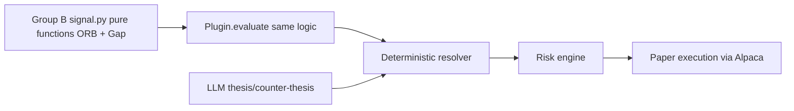

# Group B Research Plan — Opening-Range Breakout & Gap Continuation (SMH/SOXL)

Working plan; live execution on branch `research/group-b-orb-gap` (local clone directory referred to below as `live-repo/`)
Owner: Group B packet owner (you) · Reviewer: Group C owner
Source docs: `docs/index.md` → `docs/research/GROUP_B_SEMICONDUCTOR_PLAN.md` (primary), `docs/plans/STRATEGY_RESEARCH_PLAN.md`, `docs/architecture/STRATEGY_API.md`, `docs/architecture/RESEARCH_INTERFACE_FREEZE.md`

## Why this matters for judging

| Judging criterion | How this work scores it |
|---|---|
| P&L performance | A preregistered, cost-stressed signal is the honest path to a live champion; weak candidates are rejected early instead of bleeding the judged account |
| Technology implementation | Plug-in conforms to the frozen `StrategyPluginV1` contract; deterministic signal + LLM veto resolver is the intended architecture |
| Creativity & originality | Semiconductor pair (SMH unleveraged control + SOXL leverage stress cell) with falsification-first methodology |
| Presentation & execution | Reproducible evidence trees, promotion cards, pair-cell metrics make the demo/write-up credible |

## Architecture fit

Group B owns only box A/B: the deterministic signal plug-in. The LLM may explain or veto; it cannot rewrite the strategy, choose contracts, or alter risk.

## Non-negotiables (stop conditions)

1. **Provenance (verified 2026-08-30):** zip anchor `cb03a7684fb67c6f0888333f6c3c2145e8645be9` + `uv.lock` SHA-256 `b846dc0b4d52be240cbb131e8267a5bf5ed4659b21570573b9ea1d48dcc865cf` (zip hash verified). Live base `origin/main` = `2852910d563122e73d92e16c93d374afdd4bcda2` — 19 commits ahead of the pin, anchor-checked (Phase 0 record below); main's re-locked `uv.lock` SHA-256 `3d37e9c7a24febdb41ccf5fec815613b818ea76fc66ecd0cc1ec9a89715ba114` is the newly recorded lock. Drift beyond this recorded chain = stop.
2. **Freeze before P&L:** both candidates' specs (hypothesis, features, configs, sensitivities, reason codes, state schema, exit policy) frozen before viewing any outcome P&L — gate `B2_SPEC_FREEZE`.
3. **No private data:** only data-steward immutable artifacts; no Yahoo/Polygon/vendor data, no credentials, no orders.
4. **No self-promotion:** terminal state is `RESEARCH_COMPLETE` / `INTEGRATION_READY` at most; never `PAPER_ENABLED`. Registry proposal stays `research_only`.
5. **No winner-picking:** pair-cell evidence retains both SMH and SOXL rows; central owner does full-universe arbitration later.
6. **Plug-in purity:** no network/filesystem/clock/random/env; entry-only semantic output; exact-order fields forbidden.

## Phase 0 — Environment & live branch (EXECUTED 2026-08-30)

- Cloned `https://github.com/lipengyuan1994/alpaca-hackathon.git` → `live-repo/` (all branches; zip extract retained as read-only reference).
- Movement check: `origin/main` = `2852910d563122e73d92e16c93d374afdd4bcda2` ("Merge pull request #6 … Group A strategy research and V12 wheel backtest"); merge-base with pin `cb03a768` = the pin itself — main moved strictly forward, 19 commits, no divergence. Teammate branches `codex/build-regimeswitch-strategy-packages`, `dev/framework-enhance-pat`, `docs/formal-architecture-design` — **all fully merged into main** (`git branch -r --merged origin/main`).
- Anchor check (zip ↔ main): `docs/architecture/STRATEGY_API.md` byte-identical; `RESEARCH_INTERFACE_FREEZE.md` + `GROUP_B_SEMICONDUCTOR_PLAN.md` differ only by central governance edits (read-only collector attestation workflow; `B0_HANDOFF` now requires attested `data_manifest.json`/`entitlement_probe.json`); `packages/contracts/models.py` purely additive central-side economic-advisory models (`EconomicAssessmentV1`, `SignalDecisionAuditV1`, …) — strategy-facing V1 surface untouched; `uv.lock` re-locked on main (expected: new central deps).
- **Only frozen-parameter change: discovery/warm-up start `2017-01-03` → `2020-07-27`** — pre-outcome, centrally frozen `research/shared/coverage_exceptions/alpaca_free_iex_history_floor_v1.json` ("no minute-bar history before 2020-07-27" on the free-tier IEX collector), applies identically to all six candidates including both Group B families. All strategy thresholds, folds, bootstrap, gates unchanged.
- Branch `research/group-b-orb-gap` created from `origin/main` (`2852910d`), tracking origin. Push policy: only this branch, never main, never force-push.
- **Baseline EXECUTED 2026-08-30** (§8 researcher clause — commands, OS, CPU, output hashes):
  - **Windows/x86-64** — Windows-10-10.0.19045-SP0 (AMD64), CPython 3.12.10, uv 0.12.7 invoked as `python -m uv`, venv off-Drive at `%LOCALAPPDATA%\group-b\live-repo-venv` via `UV_PROJECT_ENVIRONMENT`. `uv sync --frozen` OK. `python -m uv run --frozen ruff check .` → **All checks passed!** Three frozen host-interface files (`tests/security/test_strategy_authorization.py`, `tests/contract/test_feature_contract.py`, `tests/contract/test_strategy_arbitration.py`): 4 failed + 13 errors, **every one** the POSIX-only runner gate (`packages/strategy_runner/runner.py` `_limit_process` needs `resource`-module RLIMITs → child spawn unavailable on Windows → `PluginIsolationError`). Expected: Windows is not a supported runner platform; zero logic failures.
  - **WSL Ubuntu-24.04/x86-64** — kernel 6.18.33.2-microsoft-standard-WSL2, 4 vCPU / 3.8 GB RAM, system CPython 3.12.3, uv 0.5.9, venv `~/.venv`; blob-exact tar mirror of `2852910d` at `~/group-b/posix-baseline/live-repo`. `uv sync --frozen` OK. Canonical command: `setarch x86_64 -R uv run --frozen pytest -q tests/security/test_strategy_authorization.py tests/contract/test_feature_contract.py tests/contract/test_strategy_arbitration.py` → **31/31 PASSED**. `ruff check .` → pass.
  - **Full-suite caveat (root-caused, not patched):** whole-tree `pytest` on this WSL VM is nondeterministically red — every failure is `PluginIsolationError: PLUGIN_ISOLATION_FAILURE: runner exited non-zero` (silent SIGKILL, empty stderr; one downstream `DECISION_RUNTIME_RETRY_REQUIRED` wrap in `tests/economic/`). Measured cause: frozen `RLIMIT_CPU=(1,1)` vs `import packages.strategy_runner.child` costing ~1.3–2.1 s user CPU on this contended VM → 60-sample bare-import death rate **10.0 %** under `ulimit -t 1` alone, **8.3 %** under both frozen limits (memory ruled out: 80/80 pass under `ulimit -v 262144` alone). Failures move between runs and within files across reruns — per-spawn dice-roll, zero logic failures. `runner.py` is central-owned/frozen: **no local mitigation applied**; the central native-ARM64 macOS baseline `PASSED_AT_cb03a76` (faster CPU, RLIMIT_AS darwin-skipped) remains authoritative.
  - Chunked full-suite diagnostic logs at `~/group-b/posix-baseline/baseline-logs/` (SHA-256): chunk1 `6b033bd555fc73491f1e6088a88e34118b31565c90a006bd03df57d25f5816a6`; chunk2 `b7b77f0aa3f3d3ad9db53f89f9ad40ec0a8911d292c4013aab489758013073cb`; chunk3 `41a07dfc3f94301e43583fe895d44442a38bf1465b850c79523fdbf75d569ea6`; chunk4 `a92dfcf77e9090eb8fd5f037af432518811290f04dbb725a7517bca8d65efdd7`; chunk5 `a82a0b51cd86fa0131904e08c34ef556963104f0e3677f688117e093ebf2d3fe`; chunk6 `754b3f19f7fbb4a623e45a09c99aad1735b98d1bf97d5f7b4a31ccac166c6ae0`; combined `8ff61519bc74ba83b68d13ed0ae5cd09013bbffdb482816e662e39ff3ce2b37a`.

## Phase 1 — Spec freeze (gate `B0_HANDOFF` + `B2_SPEC_FREEZE`)

For each candidate (`opening_range_breakout__all_feasible__o2_v1`, `gap_continuation__all_feasible__o2_v1`) under `research/candidates/<id>/`:

- `strategy_card.md`, `hypothesis.yaml`, `feature_contract.yaml` (all Section 8 keys: opening-range high/low/width-log, up/down break fractions, volume ratio, session VWAP, prior close/open + raw audit twins, gap/sigma/gap_z, first-hour return, continuation ratio, session/quality flags), `central_config.json` (exact frozen keys from Group B §9.1), `sensitivities.yaml` (only the prescribed values), `reason_codes.yaml` (closed enum from §9.2), `state_schema.json` (sequence 0, payload `{}`), `data_refs.json`, `artifact_schema.json`.
- Compute and record distinct candidate feature-contract hash for each.
- Parameter budgets frozen: ORB (break 0.10 [0.05/0.15 diag], volume 1.25 [1.00/1.50 diag], 60m exit [45/90 diag]); Gap (|gap_z| 1.00 [0.75/1.25], continuation 0.25 [0.00/0.50], 60m exit [45/90]).
- **EXECUTED 2026-08-30 (commit `10b38e2`, pushed to `origin/research/group-b-orb-gap`):** both candidate trees frozen — 12 files each under `research/candidates/`, all LF-normalized so working-tree, git-blob, and fresh-clone bytes hash identically; 7 per-candidate SHA-256 slots plus shared central slots (catalog `74906ee7`, allocator `864fe5d4`, position policy `c77bfe13`) bound in each `strategy_card.md`; all 14 hashes re-verified against working-tree bytes immediately before commit (`costs.yaml` intentionally identical across candidates — shared cost policy). Trial ledger + B0 handoff record: `research/trials/group_b_trial_ledger.json` — B0 status `PARTIAL_BLOCKED_ON_STEWARD_ARTIFACTS`: baseline, native lock, owner, and both candidate IDs recorded; attested `data_manifest.json`/`entitlement_probe.json`/feasibility manifest and Group C reviewer identity remain pending. No outcome P&L viewed; gates B1+ not started.

## Phase 2 — Data intake

- Consume only: `research/shared/` data manifest, `entitlement_probe.json`, signed `selection/option_proxy_feasibility_manifest.json`.
- Verify every hash; any mismatch → visible failed gate, no improvisation.
- Frozen periods: discovery 2020-07-27–2023-12-29 (floor set by centrally frozen coverage exception `research/shared/coverage_exceptions/alpaca_free_iex_history_floor_v1.json`; discovery was 2017-01-03 pre-exception); option calibration 2024-02-01–2024-12-31; OOS folds 2025Q1–Q4; final accept/reject 2026-01-02–2026-08-27. Early closes excluded (`EARLY_CLOSE_SESSION`).

## Phase 3 — Code (two canonical plug-in packages)

Tree per family: `strategy_plugins/<plugin_id>_v1/` with `pyproject.toml`, `manifest.yaml`, `README.md`, `hypothesis.yaml`, `defaults.yaml`, `src/<plugin_id>_v1/{__init__,plugin,signal,reason_codes,reproduce}.py`, `scripts/reproduce.{sh,ps1}` (thin wrappers), `tests/{fixtures,golden,test_contract,test_thresholds,test_no_trade,test_determinism,test_boundary,test_parity}.py`, `evidence/promotion.json`.

Key rules:

- `signal.py` = single pure economic function; `plugin.py` calls it — byte-parity on golden rows.
- Bullish → `CALL_DEBIT_SPREAD_V1`, bearish → `PUT_DEBIT_SPREAD_V1`; horizon `INTRADAY_15_60M`, tier `TINY`, TTL 300s; score buckets `[1.00,1.25)=LOW, [1.25,1.75)=MEDIUM, >=1.75=HIGH`; evidence ref = `FEATURE_VECTOR`; content hash = `UNBOUND_PLUGIN_CONTENT_HASH`.
- Clock: 15-min ET half-open intervals from 1-min IEX bars, availability = end+1s; entries 10:30:01–14:30:01 every 30 min; next-minute-open execution proxy; exits via `TREND_VWAP_OR_60M_V1` replay (adverse VWAP close cross or fill+60m capped 15:45); first-entry-only per symbol/session; final-Thursday flatten rules.
- Reproduction contract: `uv run python -m <plugin_id>_v1.reproduce --data-manifest ... --feasibility-manifest ... --output ...` refuses nonempty dir, validates hashes, runs tests, no network, deterministic artifacts.

## Phase 4 — Runs & evidence

- Pair cells SMH/SOXL: central + every prescribed sensitivity + falsification removals (ORB: drop volume/VWAP confirmations, gap-size slices, overlap with other families; Gap: direction/gap-size/vol/macro-date slices, drop continuation/VWAP).
- Bootstrap: synchronized centered 5-session circular blocks, PCG64 seed `20260829`, 10,000 reps; identical blocks across candidates; family-wise max-statistic control.
- Artifacts per run: `run_manifest.json`, `pair_cell_metrics.json`, `signals/selected_contracts/proxy_leg_observations/trades/daily_returns/fold_metrics.parquet`, `metrics.json`, `cost_stress.json`, `split_adjustment_audit.json`, `semiconductor_pair_attribution.json`, `portfolio_replay.json`, `limitations.md`, plots. Zero-return inactive dates retained.
- Option proxy only if feasibility manifest selected the symbol: O2 debit vertical (7–14 DTE central; nearest-to-spot long, ~1% OTM short; simultaneous obs; qty under fee-inclusive min($500, 0.5%·equity)); O1 single-leg diagnostic only. Else empty schema-valid tables + `option_proxy_not_selected.json` (`NOT_SELECTED_BY_FEASIBILITY`).
- Promotion gates: ≥75 OOS trades/40 sessions, ≥4 populated quarters, ≥60% positive folds, concentration <25%, sign stability; option support adds ≥50 trades/30 dates, missing-exit ≤10%, positive base net, nonnegative severe/2×, OOS DD ≤4%.
- **EXECUTED 2026-08-31 — engine shipped, outcome runs still blocked (commit `f11d9e8`, pushed to `origin/research/group-b-orb-gap`):** deterministic pair-cell replay engine `packages/research_data/group_b_pair_cell.py` (986 lines) + feature layer `packages/research_data/group_b_features.py` + synthetic-fixture suite `tests/research_data/test_group_b_pair_cell.py` (20 tests, all passing; ruff E,F,I,B clean; full `tests/research_data` suite 47/47 green). Scope decisions recorded for Group C review:
  - Outcome `main()` remains fail-closed: validates attested steward gates, then raises `OUTCOME_RUNS_BLOCKED_UNTIL_STEWARD_DATASETS_PUBLISHED`, writes `pair_cell_refusal.json`, exits 2 — no real-data run before `research/shared/` artifacts exist.
  - Engine replays the frozen packages directly (9 variants per candidate: central + 6 diagnostics + 2 falsification removals), computes the canonical content hash locally — Group B src-layout packages are not covered by `packages/plugin_integrity`'s flat-layout registry hash; same material scheme (sorted `*.py`, path+sha256, `canonical_hash` with entrypoint), frozen packages untouched.
  - Degenerate diagnostic parameters (e.g. `continuation_ratio_threshold=0.00` makes the frozen score division undefined → `decimal.DivisionByZero`) fail closed per-decision with reason `SIGNAL_EVALUATION_UNDEFINED` instead of aborting the replay; all 9 variants still run.
  - Shared `packages/research_data/artifacts.py` hardened for Windows (first Windows exercises of these paths): directory fsync made best-effort (`_fsync_directory`; Windows refuses `os.open` on directories), parquet durability fsync now opens `"r+b"` (Windows forbids fsync on read-only handles). Behavior-identical on POSIX; Group A neighbor suites re-run green before commit.

## Phase 5 — Review & return

- Group C reviewer runs `reproduce.py`, reproduces hashes/metrics + one negative fixture, signs `pair_cell_review.json`.
- Defects after outcomes seen → new versioned candidate + trial-ledger entry (never silent tuning).
- Integration artifacts per family: `registry_candidate.yaml` (`research_only`), ≥20 golden parity contexts (`backtest_runtime_parity.json`, byte-identical double-run), `conformance_report.json`, `catalog_parity.json`, `integration_checklist.md`, `promotion_card.md` with one truthful terminal state.
- LIVE cadence (user-approved 2026-08-30): push `research/group-b-orb-gap` after each milestone — only this branch, never main, never force-push, central configs untouched until PR. At handoff (user's signal): open a PR to the lead for central full-universe replay.

## Phase 5R — Group B as ring reviewer: PARTIAL pre-review of Group A packages (2026-08-31)

Ring duty (README.md:15-17): Group B reviews Group A. Scope: `strategy_plugins/intraday_continuation_v1` + `strategy_plugins/vwap_reversion_v1` (candidates `intraday_continuation__all_feasible__o2_v1`, `vwap_reversion__spy_qqq_smh_igv__o2_v1`) against `docs/research/GROUP_A_BROAD_TECH_PLAN.md`. **Status: PARTIAL — defects reported, nothing signed, no reviewed rule tuned.**

Commands executed + results (venv `live-repo-venv`, Windows 10, cwd `live-repo`):

- `pytest -q tests/research_group_a` → **12/12 passed** (no package-local suites exist in either Group A package; this central suite is the executable evidence). `ruff check` on both packages → clean.
- Frozen-hash consistency: each candidate's `feature_contract_hash` is byte-identical across `plugin.py:23` ↔ `manifest.yaml:11` ↔ `registry_candidate.yaml:12` (registry status `PROPOSAL_ONLY_NOT_REGISTERED`). Eight attempted canonical derivations from `feature_contract.yaml`/registry payloads (full parsed YAML, subsets, symbol/key lists, candidate-id forms) **none matched** — recorded as a provenance limitation (no documented derivation), not tamper.
- Independent reviewer probe (8/8 passed; driver kept outside the repo at workspace root, never committed): (A) missing data manifest → both packages exit 2 + `reproduction_refusal.json` `DATA_MANIFEST_INVALID`; (B) unready feasibility manifest → exit 2 `FEASIBILITY_MANIFEST_NOT_READY`; (C) synthetic happy paths → exit 0, `run_manifest.json` status `INPUTS_VALIDATED_OUTCOME_RUN_PENDING`, correct candidate ids, `run_hash` present, `data_manifest_hash` matches; (D) golden negatives through the pure signal path — intraday golden case 3 (`close=100, momentum_z=1.00, vwap=100` → NO_TRADE, `INTRADAY_CONTINUATION_GATE_NOT_MET`, score 1.00) and vwap golden case 3 (`deviation_z=-1.50, momentum_z=0.50` → NO_TRADE, `VWAP_REVERSION_GATE_NOT_MET`, score 1), both exactly matching `tests/golden/signal_cases.json`.

Verified PASS: reason-code namespaces exact per §235-241 (12 common + family entries + GATE_NOT_MET, closed set); allowed universes, feature-key order, 60 s observation age, `needs_logical_positions=False`, 30-min decision grid, score buckets `[1.00,1.25)/[1.25,1.75)/>=1.75`, CALL/PUT tuple gating with TEMPLATE/TUPLE distinction, no winner-picking (`len(candidates)!=1 → DIRECTION_AMBIGUOUS`), daily-entry state, strict VWAP alignment (equality refuses), threshold equality enters, strict `<0.50` momentum-neutrality gate, `defaults.yaml`/`hypothesis.yaml` vs plan, reproduce CLI shape §9.3.

Defects (reviewer reports only; Group A fixes): (1) flat layout vs §186 explicit prohibition/prescribed `src/<plugin_id>_v1/`; (2) `decision_schema_version` missing from both `manifest.yaml` (§231); (3) zero package-local `test_*.py` (§202-210 prescribes six) — central `tests/research_group_a` substitutes; (4) missing `evidence/promotion.json` (§211-212); (5) golden `signal_cases.json` 3 cases each vs §10 category minimums (missing-observation, variance-floor, stale/quality-flagged, early-close/outside-window, …); (6) golden JSONs orphaned — no test consumes them; (7) candidate trees missing `strategy_card.md` + `runs/<run_id>/` (§215); (8) missing `integration/backtest_runtime_parity.json` ≥20 timestamps (§282); (9) `reproduce.py` does not run package tests (§245 requires it) and is honestly a preflight (`INPUTS_VALIDATED_OUTCOME_RUN_PENDING`); (10) hash provenance: not re-derivable from any documented procedure (above); (11) cosmetic `regimeswitch-` pyproject name prefix; (12) `scripts/reproduce.sh` absent (optional per §200-201).

Signature: **not given.** Both `research/candidates/<candidate_id>/integration/pair_cell_review.json` placeholders remain `PENDING_INDEPENDENT_GROUP_B_REVIEW` / `reviewer: null` — per STRATEGY_RESEARCH_PLAN.md:929 and GROUP_A_BROAD_TECH_PLAN.md:283-284 the signable record is the deterministic reproduction record for an actual run; no Group A run exists yet (their own gate blocks on `research/shared/` steward artifacts, same as ours). Deferred until a run exists: full §10 category audit, runtime-parity double-run, metrics reproduction. No ungoverned `research/reviews/` folder created.

## Phase 5S — Group B member as ad-hoc data steward: base collection `alpaca_research_shared_v1` (2026-08-31)

README.md §2 makes steward artifacts the team-wide blocker; no `research/shared/` publication existed. The Group B owner (user) generated personal free-tier paper keys and volunteered as steward (declining Group C takeover per ring conflict). Collection executed per ALPACA_DATA_COLLECTOR.md; nothing below tunes any reviewed rule.

- **Credentials handling:** paper key/secret written once to `%USERPROFILE%\.config\great_secrets\alpaca\alpaca_api_key.yaml` (outside the repo), consumed via `REGIMESWITCH_SECRETS_DIR` pointing at that directory. Keys never appear in any command line, shell history, or repo file. GET-only client (`paper-api.alpaca.markets`); no account/position/order endpoint touched. Entitlement probe confirms `OBSERVED_READ_ONLY_ACCESS` for `/v2/calendar`, `/v2/options/contracts`, `/v2/stocks/bars` (iex feed), `attestation_required: false`.
- **Output tree:** `C:\alpaca-research-data\alpaca_research_shared_v1` — outside the repo and outside the synced workspace drive. Frozen spec `configs/research_data_collection_v1.yaml` (`spec_hash sha256:a1304e87…`), `git_revision 87ffbb8c` (this branch's pushed review commit), all stages exit 0:
  - `calendar` — 1 raw page, `normalized/calendar.json`;
  - `stock_raw` — 2,679,125 rows / 268 raw pages, `stock_bars_raw.parquet` sha256:8ef5040d… (~12 min);
  - `stock_split` — 2,679,125 rows / 268 pages, `stock_bars_split.parquet` sha256:acb52d61… (~13 min);
  - `contracts` — 475,535 rows / 49 pages, `option_contracts.parquet` sha256:cfcb8712… (~7 min; contracts metadata is readable on the free tier — does not imply historical option bars are).
- **Finalize:** `data_manifest.json` status `COLLECTED`; embedded probe sha256 `6f935194…` == file sha256 ✓. **Feasibility:** blinded unsigned draft `feasibility_draft.json` status `READY_FOR_REPLAY`, `selection_method blinded_data_quality_then_frozen_symbol_order/v1`, cutoff rank 3 → selected **SPY/QQQ/TQQQ**. All six symbols eligible (0 duplicate bars, `ohlc_valid`): ranks SPY 1 (601,253 rows), QQQ 2 (575,536), TQQQ 3 (481,088), SMH 4 (343,327), SOXL 5 (409,645), IGV 6 (268,276). Binding verified: `feasibility.data_manifest_hash == data_manifest.manifest_hash` (`sha256:6d345582…`).
- **Observations for the lead (reported, nothing changed):**
  1. The frozen cutoff at rank 3 excludes **SMH and SOXL** from option-proxy selection → per Phase 4, Group B's option path would honestly terminate as `option_proxy_not_selected.json` (`NOT_SELECTED_BY_FEASIBILITY`) unless the lead's selection/attestation policy differs. Ranking followed frozen spec symbol order among fully eligible symbols — no data-quality basis to invert it.
  2. Our own B0 gate `_validate_steward_gates` (group_b_pair_cell.py:963-965) requires a top-level `symbols` list in the data manifest; this finalized manifest carries none (symbols are bound via `spec_hash`). The gate would fire `DATA_MANIFEST_PAIR_SYMBOLS_MISSING` despite full SMH/SOXL coverage. Engine unmodified — whether to widen the gate to spec-bound symbols is the lead's/Group C's review call.
  3. `main()` still refuses with `OUTCOME_RUNS_BLOCKED_UNTIL_STEWARD_DATASETS_PUBLISHED` after gates pass — by design until `research/shared/` exists and README §2.5's signed selection manifest step completes. This collection does not self-authorize outcome runs.
  4. Payloads are not git-sized (≈138 MB normalized + 276 raw JSON pages). In-repo publication can carry the small governance JSONs (`data_manifest.json` ≈310 KB, `feasibility_draft.json` 1.5 KB, `entitlement_probe.json` 416 B); payloads need a lead-chosen artifact channel or a steward re-run on the lead's runtime.
- **Publication state:** `research/shared/` NOT created on this branch — README §2.5 requires the lead's signed/blinded selection manifest, and §2.40's separate review/attestation step remains mandatory before researchers consume the manifest. This protocol record + the collection tree on the steward disk are the handoff package for the PR at the user's signal.

## Open questions for the lead

1. Resolved 2026-08-30: live clone verified; `origin/main@2852910d` anchor-checked against zip pin `cb03a768` — one centrally frozen coverage exception (discovery start `2020-07-27`) recorded in Phase 0; branch `research/group-b-orb-gap` created from `origin/main`.
2. Largely resolved 2026-08-31 by Phase 5S: the ad-hoc steward collection (`alpaca_research_shared_v1`) exists on steward disk with `data_manifest.json` status `COLLECTED` and a blinded feasibility draft `READY_FOR_REPLAY` — but it is **unsigned/unpublished**: README §2.5 requires the lead's signed selection manifest, and §2.40's separate review/attestation step must complete before researchers consume it. `research/shared/` remains uncreated pending the lead's decision on Phase 5S observation 4 (payload channel) and observation 1 (SMH/SOXL selection impact).
3. Group C reviewer identity for `pair_cell_review.json`.
